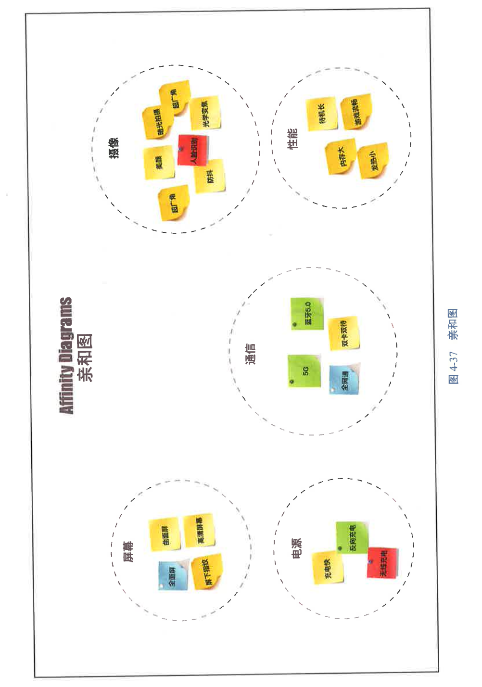

# 读书笔记之《PMP备考宝典》

## 意义和逻辑

项目是为创造独特的产品、服务或成果而进行的临时性工作。

项目的特征：  
- 独特性：独一无二，没有完全一样的两个项目，没法简单重复过去的做法  
- 临时性：也称一次性、阶段性，项目总有开始和结束，是“临时性”的工作  
- 不确定性：项目就是在不断应对变化，风险如影随形，只能渐进明细  

以项目为单元的精细化管理模式的特点如下：  
- 以项目为单元配置资源  
- 平台型组织，扁平化管理  
- 面向战略，交付价值  
- 关注成长，追求共赢  

项目管理的基本目标是在规定的时间内，在批准的预算内，完成事先确定的工作范围内的工作，并使项目达到预期的质量和性能的要求。

项目工期与成本的关系：  
一般来说，项目工期太长，成本会上升，因为虽然工作量（直接成本）没增加，但房租、管理费等间接成本每天都在发生；  
而项目工期太短，成本也会上升，因为如果团队在更短的时间内完成工作，通常要增加资源投入，所以直接成本上升。  

项目管理的进阶目标是实现资源优化，实现组织战略目标，让项目干系人满意。

项目管理的高阶目标是以人为本，实现社会责任和环境友好。

| 甲方   | 乙方   |
| ------ | ------ |
| 业主   | 服务商 |
| 需求方 | 供给方 |
| 发包方 | 承包方 |
| 买方   | 卖方   |


- 项目：公司产品研发、为客户交付服务、管理变革等。  
- 运营：持续、重复、流程化的工作。例如，财务部门每天都要记账，每周都要处理报销，每个月都要报税。  
  这些工作过去这么做，现在这么做，以后还得这么做，这就是运营。  

| 对比维度 | 项目                       | 运营               |
| -------- | -------------------------- | ------------------ |
| 特性     | 独一无二                   | 重复多次           |
| 时间性   | 有始有终                   | 持续不断           |
| 性质     | 革命性（只有一次成功机会） | 渐进性（逐步改进） |
| 权责     | 责权不均衡                 | 责权均衡           |
| 组织形式 | 临时性组织                 | 稳定性组织         |
| 导向     | 效果导向                   | 效率导向           |
| 风险     | 不确定性（风险）           | 确定性（经验）     |
| 管理方式 | 针对性计划                 | 标准化流程         |


| 对比维度 | 项目经理               | 职能主管               |
| -------- | ---------------------- | ---------------------- |
| 扮演角色 | “帅才”                 | “将才”                 |
| 知识结构 | “通才”                 | “专才”                 |
| 管理方式 | 目标管理               | 过程管理               |
| 工作方法 | 整合的方法             | 分析的方法             |
| 权责     | 责大权小               | 权责对等               |
| 主要任务 | 计划、组织、协调、指导 | 技术、流程、标准、规范 |

项目管理的12个原则：  
1. 成为勤勉、尊重和关心他人的管家
2. 识别、评估和响应系统交互
3. 驾驭复杂性
4. 创建协作的项目团队环境
5. 展现领导力行为
6. 优化风险应对
7. 有效的干系人参与
8. 根据环境进行裁剪
9. 拥抱适应性和韧性
10. 聚焦于价值
11. 将质量融入过程和可交付成果中
12. 为实现预期的未来状态而驱动变革

项目类型：  
- 明星项目：销售增长率和市场占有率都高。  
  该类型的项目优先级最高，企业应该重点支持。  
- 金牛项目：市场占有率高，但销售增长率低。  
  这类项目往往是公司的传统优势业务，但是由于被新技术取代等原因，市场增长乏力甚至开始萎缩。虽然市场增长无望，但目前该类项目还是公司的主要收入来源。  
  针对这类项目，即使企业投入再多的资源，也无法取得销售增长，所以企业不应该浪费更多资源在这类项目上，只要保持现在的市场占有率就好。  
- 问题项目：市场占有率低，但销售增长率高。  
  这类项目是公司用于探索新市场或创造新产品的项目，是否最终能够获得足够的市场占有率并成为新的明星项目，还不得而知。  
  企业很可能尝试了10个项目，最终只成功了1个，不过这1个成功的项目为企业带来的回报足以抵消9个失败项目的损失。  
  这种带有风险投资性质的项目，企业应该拿出专门的资源积极尝试。  
- 瘦狗项目：市场占有率和销售增长率都低。  
  投入这类项目，企业在目前和今后都很难挣到钱。  
  那么企业为什么还要做呢？企业往往出于保持团队规模、平稳过渡等原因，主动选择做这些看上去“没有意义”的项目。  
  企业做这类项目的意义就在于，如果企业不做，可能影响团队稳定和企业战略安全。  

项目集是一组相互关联且被协调管理的项目、子项目集和项目集活动。通过管理项目集，可以获得分别管理所无法获得的效益。  
例如，一款新能源汽车的生产，需要有电机开发、电池开发、电控系统开发项目。企业只有将这几个项目统筹管理，接口匹配，进度对齐，才能实现新车如期交付。  

组织项目管理（OPM）:  
组织项目管理指的是企业合理应用项目组合管理、项目集管理、项目管理，对项目进行科学的统筹协调，合理配置资源，并创造适合项目高效运行的企业流程、制度、文化环境，以提升企业投资回报，实现企业战略发展规划。  

| 层次         | 范围                 | 目的     | 管理要点     | 成功标准         |
| ------------ | -------------------- | -------- | ------------ | ---------------- |
| 管理成熟度   | 制度 + 流程 + 文化   | 管理环境 | 制度流程建设 | 企业成熟         |
| 项目组合管理 | 项目 + 项目集 + 运营 | 健康发展 | 优先级       | 投资效益         |
| 项目集管理   | 多项目               | 能力建设 | 逻辑管理     | 需求利益         |
| 项目管理     | 单项目               | 产品实现 | 目标管理     | 进度、成本、质量 |

做项目的根本目的不是为用户创造有形的产品或无形的服务，而是通过产品或服务用户交付价值：  
- 应该准确识别真正对用户有价值的需求
- 应该尽量避免不创造价值的活动
- 应该让价值不间断地流动起来

敏捷宣言:  
我们正在揭示更好的软件开发方法，我们使用它并且帮助其他人使用  
通过这些方法，我们惠识到：  
- 个体与交互 胜过 过程和工具
- 可用的软件 胜过 完备的文档
- 客户协作   胜过 合同谈判
- 响应变化   胜过 遵循计划

在每组对比中，右项井非全无价值，但我们更看中左项的价值

传统项目管理方法的特点是强计划、强控制，敏捷方法的特点是快节奏、快反馈。

| 对比项 | 传统项目管理                             | 敏捷方法                                     |
| ------ | ---------------------------------------- | -------------------------------------------- |
| 计划   | 工作总能被很好地计划                     | 任何确定的计划几乎都没什么用处               |
| 执行   | 计划总能被很好地实施                     | 计划总是不断被修改                           |
| 制约   | 范围、进度、成本可以互相调剂和平衡       | 周期和资源（人力）是恒定的，只有范围可以调整 |
| 成功   | 准时在预算内完成所有既定目标             | 客户获得真正的商业价值                       |
| 变更   | 范围被事先锁定，只能通过变更控制程序修改 | 范围保持灵活，任何时候的变更都可以接受       |
| 控制   | 利用基准从头到尾控制整个项目的进程       | 从头到尾控制项目是不可能的，适应变化才是王道 |
| 团队   | 团队接受项目经理领导，按计划行事         | 团队自组织，释放个性                         |

以 Scrum 敏捷框架为例，每个冲刺（Sprint）虽然只有1~4周，但是在这个短短的 Sprint 中：  
- 团队有完整且规范的 Sprint 计划会（规划过程）
- 每日站会（15分钟）通报进展和问题（监控过程）
- Sprint 评审会（对交付的增量进行评审，对应收尾过程中的合同收尾）
- Sprint 回顾会（总结和分析团队的不足和改进方法，对应收尾过程中的行政收尾）

而且 Sprint 计划会和每日站会都起到了启动过程的作用。

在敏捷方法中，团队对于产品待办事项列表（Product Backlog）中的待办事项的管理思路也相同，即根据优先级的高低确定细化颗粒度的粗细。

敏捷方法仍然继承了传统项目管理方法中的大量经验与智慧，只是以更短的周期、更快的节奏、更灵活的方式来应对易变的项目。  
我们在实践中要根据项目的特点选择恰当的项目管理方式。例如：  
互联网软件项目的需求未知性强、变化快，要求团队快速响应、快速交付，所以团队宜采用敏捷方法；  
而工程建设项目涉及的专业多、工艺复杂、变更成本巨大，所以团队宜采取预测型的开发方法。  

## 备考建议

项目管理的价值观和方法论之10个成语：  
1. 未雨绸缪  
   现实中的我们往往只把计划挂在嘴上，应付差事，不管是行动上还是思想上都缺乏对计划最基本的尊重，拿“计划赶不上变化，变化赶不上领导一句话”当借口，来掩盖自己在计划上的懒惰。  
2. 防微杜渐  
   项目管理五大过程组中的“监控过程组”监控的是项目实际执行的情况和计划是否一致，如果不一致，就意味着出现偏差。  
   例如团队按计划到今天应该完成20个功能点的开发，而实际只完成了18个，这就出现了进度偏差，团队就要想办法采取措施及时纠正，不能让偏差继续扩大。  
   如果最后偏差大到失控，那就无法挽回了。  
3. 资源集成  
   项目管理中强调资源集成，意思是项目经理不应该把自己困在具体的技术或业务中。  
   项目经理的主要任务是找到最合适的人去搞定这些事，这就是资源管理。如果在企业内部找不到，就去外面找，即通过外包的方式整合企业外部资源，共同实现项目目标。  
   “项目越大，资源越不是你的，不为你所有，只为你所用！”擅长整合资源的项目经理会更优秀，擅长整合资源的企业往往能成为产业的龙头。  
4. 恰到好处  
   项目范围管理强调“做什么，且只做什么”。也就是说，为了达到项目目标，团队要明确必须做的工作（即项目范围），而且只做这些工作。  
   如果团队成员超出范围做了任何本来不用做或者可做可不做的事，必然消耗时间和资源，这通常是导致项目延误、成本超支的罪魁祸首。  
   质量管理也一样，质量不合格不行，质量超出标准也不好，因为超出标准的质量意味着多花了时间或者多花了钱，而且没人认可。  
   我们要重新审视自己的“价值观”，在项目管理的世界里不要追求完美。完美并不美，恰到好处才最美！  
5. 循规蹈矩  
   《PMBOK®指南》里的过程，就为我们定义了一套做项目的规范动作。如果按这些过程来开展项目，你就有章可循，有据可依。  
   即便你认这些过程十分教条和烦琐，想要放弃，也要认真想想这些可都是大量优秀企业的经验总结，按他们的套路来，结果不一定最优，但至少不会太差。  
6. 锲而不舍  
   虽然需求层出不穷，变更无休无止，风险变幻莫测，项目风雨飘摇，但是我们不能动摇为客户/用户创造价值的初心。  
   没有哪个项目可以随随便便成功，我们需要有直面变化的勇气，坚持才能胜利。  
7. 积微成著  
   与其总是抱怨没有模板可以套，没有经验可以用，不如从我做起，从现在做起，把项目过程中的需求跟踪、变更决策、计划更新的点点滴滴记录下来。  
   只有日积月累，才会有组织过程资产。聚沙成塔、集腋成裘，伟大的公司都是在不起眼的细节上“傻傻”地坚持！  
8. 公开透明  
   企业要创造公开透明的纸围，鼓励每个团队成员主动沟通、积极参与，因为项目的成功离不开所有参与者的努力。  
   除了涉密信息，尽量让项目信息高效发布、充分共享。  
9. 同舟共济  
   项目是一条船，从此岸驶向彼岸。干系人都是同一条船上的人，一荣俱荣，一损俱损。做项目必须有诚信、共赢的思想，目标是让各方都满意！  
   比如，如果供应商的报价低得让人不可思议，通常的原因是供应商对你的需求理解得不准确或不完整。  
   这时，你不要沾沾自喜，以为占到便宜。如果半路更换供应商，会对项目造成难以承受的冲击，影响工期、成本、质量，这些坑都得你自己填。  
   你要记住：不要占任何人的便宜，出来混迟早是要还的，大家好才是真的好！  
10. 各司其职  
    项目章程规定，团队的分工由项目经理负责，这是白纸黑字对项日经理的授权。  
    就算他是发起人，也不能越级指挥你的团队成员干他认为重要的工作，这是原则。  
    如果这份工作真的更重要，那么发起人需要提出变更，走变更控制程序。如果变更被批准，则由项目经理来调整计划，重新分配资源。  

关于考试：  
在考试过程中，你要把握“三个不相信”和“三个相信”原则。  
1. 三个不相信  
（1）不相信翻译  
PMIP®考题的中文翻译常常词不达意，当你产生怀疑时不要犹豫，看看上面的英文原文，你会立刻感到柳暗花明。  
（2）不相信经验  
东西方在语言文字、文化、习惯、工作方式上都存在较大差异，所以你的工作经验很可能与出题人有很多不同，你要人乡随俗，按他们的套路出牌。
（3）不相信绝对  
选项中如果有“从不”“必须”“所有”“完全”这种不留任何余地的词，那么你就要小心了。“有时”“应该”“可能”“主要”这些谦和、客观的词更有可能是对的。  
2. 三个相信  
（1）相信简单  
PMP®考题不是悬疑剧，切忌演绎。当你有“万一出现 ×× ×情况”“出题的人有几层意思”这种怀疑时，要及时打住。  
没有那么多“如果”“万一”，出题的人只有一层意思！不要自己臆想出附加的条件和额外的信息。  
你要相信出题的人很单纯，虽然题干中的信息不一定都有用（有冗余或无效信息），但没有的就是不存在的。你往简单了想，就会豁然开朗。  
（2）相信直觉  
除非你有充足的依据，否则不要修改第一次的选择，跟随你的内心，你的直觉往往是最可靠的。  
通过反复听课、看书、做题，一次次的迭代会强化你的项目管理价值观和方法论，那种“只可意会，不可言传”的感觉妙不可言。  
（3）相信善良  
诚信、公正、尊重、信任、共赢这些代表正能量的价值观放之四海而皆准，它们总能指引你找到正确的答案；  
隐瞒、虚假、敌对、投机取巧、目光短浅，损人利已这些满满负能量的选项一定是要排除的。“善良”才是无坚不摧的力量。  

## 环境

企业的愿景、使命和核心价值观，这些决定了企业的发展方向。  
做项目必须遵守自己国家及项目所在地的法律、法规、行业标准、规范，依法合规是项目管理的底线。  

|          | 事业环境因素（EEFs）       | 组织过程资产（OPAs） |
| -------- | -------------------------- | -------------------- |
| **出自** | 政府、行业协会、公司管理层 | 历史项目团队及 PMO   |
| **用于** | 遵守                       | 参考                 |
| **方式** | 被动接受，人乡随俗         | 主动参与，更新维护   |

紧密型矩阵并不是一种矩阵组织，而是指团队成员集中办公（War Room），这样有利于团队建设、提高团队沟通协作效率。

|                        | 职能型     | 弱矩阵     | 平衡矩阵            | 强矩阵       | 项目型                      |
| ---------------------- | ---------- | ---------- | ------------------- | ------------ | --------------------------- |
| **项目管理者权限**     | 很少       | 有限       | 少到中等            | 中等到高     | 很高，甚至全权              |
| **项目管理者角色**     | 兼职       | 兼职       | 兼职                | 全职         | 全职                        |
| **预算和资源控制者**   | 职能经理   | 职能经理   | 项目经理 / 职能经理 | 项目经理     | 项目经理                    |
| **项目管理者常用称谓** | 项目联络员 | 项目协调员 | 项目经理            | 项目经理     | 项目总指挥 / 项目公司总经理 |
| **工作特点**           | 不解决问题 | 解决小问题 | 处理日常问题        | 处理授权问题 | 解决关键问题                |

治理可以被理解为“定规矩”，实现责、权、利的合理分配与制衡，例如，公司里谁向谁汇报，谁对谁负责。  
管理是在治理的框架下实现经营目标的所有举措。  

治理和管理都是为了组织健康发展服务的，它们之间是相辅相成的关系：  
治理给管理指明了方向、规划了路线、划清了边界；  
经营层在管理实践中也会不断向董事会反馈并与其互动，从而使董事会动态地调整和优化治理结构。  

项目治理是联系组织治理与项目管理之间的桥梁，项目经理和项目管理团队必须在项目洽理框架下开展项目管理工作。  
项目治理是把项目经理无力处理或不便处理的项目的“政治”问题（如干系人之间的利益冲突）剥离出来，交给项目指导委员会处理，以便项目经理可以专注于项目本身的管理。  

项目治理的层次高于项目管理，是高层次的项目决策机制。项目治理的作用包括但不限于以下几点：  
- 提供项目方向指导
- 提供高层及外部支持
- 监督项目管理工作
- 对项目所有权变更、项目中止等重大事项进行决策

企业文化包含三个层次，从低到高分别如下：  
- 物质层：企业的形象、标识、工作环境等
- 制度层：企业的流程、制度、人际关系
- 理念层：企业的传统、追求、价值观

项目总是处于由多种因素构成的复杂、动态、有机的系统中，很难剥离出某一种因素对项目的影响。各个因素之间相互作用，彼此影响。  
项目团队应该具备系统性思维，系统性思维包含以下三个关键词：  
- 协作：促进多专业、多部门、多组织构成多元协作体系。
- 平衡：理清各元素之间的逻辑，平衡各主体之间的关系。
- 效率：把系统当作一个生命体，不断优化演进，提升系统的效率。

掌握了这三个关键词，有助于项目团队连续做出正确的判断，减少偶然性；把目标变成可操作性的方法和步骤；也可以及时发现并纠正偏差和错误。  
拥有系统性思维常用的方法是建模和推演。  
比如在足球比赛中，赛前教练会用战术板给队员们讲解本场比赛敌我双方的阵型和战术，推演各种可能的情况。对手如果采取高位逼抢，我们如何稳固防线，如何寻找破解的机会。  
再比如，在海湾战争中联合国军构建了战争模型，推演了多种作战方案，模拟了可能发生的各种情况。  

知识积累（Stockpile）：  
支离破碎的数据、信息并不能称为知识，只有把它们组织起来才能称其为知识。  
例如，看一本书，如果只是走马观花地浏览一遍，没有通过记笔记、画思维导图等方式对作者的思想进行整理、提炼和思考，并将作者的思想与我们已有的知识进行匹配融合、重新组织、再次表达出来，那么书里的内容很快就会被我们淡忘了，书里的知识没有经过积累，就无法转化为我们自己的知识。  

知识分为显性知识和隐性知识：  
可以编辑、易于表达的知识属于显性知识，比如，可以用文字、图片、数字、表格展示的容易分享和传播的知识。  
无法编辑、难以表达的知识属于隐性知识，比如人们的经验、直觉、洞察力、诀窍。  

组织对不同形式的知识有如下不同的积累方式：  
- 显性知识的积累：创建“知识库”，并持续维护、运营  
- 隐性知识的积累：一方面，通过分享、演示、观摩、师傅带徒弟等方式，让这些隐性知识不会失传；另一方面，也要減少拥有隐性知识的人才的流失  

学习内容平均留存率和学习方式关系极大，如果采用听课、阅读这种被动的学习方式，那么留存率就会少得可怜；如果采用讨论、实践、传授这些主动的学习方式，那么留存率就会显著提高。

我们在传统项目场景下强调，在范围和进度基本不变的前提下，成本最优，而项目产生缺陷就是成本浪费。  
在敏捷场景下，不为用户创造价值的活动才是浪费。  

这些年，知识付费大热，得到、混沌大学、樊登读书会等平台不断刷新着知识付费的新高度，一门在线课程有几十万名付费用户，几千万元的单品收入已不罕见。  
这让很多人眼热心跳，也想在知识付费的赛道上搏一回。  
那么，你应该先去策划一门100节的课程，然后组建团队录制、剪辑、包装、开发APP，再投入广告推广吗？  
那得花费多少钱，投入多少时间呢？就算你做出来，有人愿意付费听你的课吗？  
这些都是未知数！有多少创业公司就这样耗光了资金，产品还没做出来，壮志未酬就身先死了。  
那么应该怎么做呢？  
你可以先准备一段10分钟的课程内容，不需要精雕细琢，只要能体现你的课程特色就行了，然后在朋友圈里召集感兴趣的人进微信群，约定好时间就可以在群里开讲。  
接下来，你要做好心理准备，迎接暴风骤雨般的吐槽！  
根据大家的反馈，你要不断修正你的产品定位，不断试错，发现和留下对的内容，直到有很多人愿意付费听你的课。  
这样做能花多少钱，能有多大风险呢？其实创业并不是遥不可及的，不是吗？  
MVP 的原则就是用最少的资源、最短的时间做试验，获得早期用户的反馈，验证产品的价值。  

原型：  
开发产品不是把未经用户验证的需求交给团队，而是先向用户演示产品原型（Prototype）。  
这些原型可能是手画的、泥捏的、纸糊的，虽然它是假的，但是很直观、很生动，远比一大堆模棱两可的描述文字更有价值。  

风险来源于不确定性，包括负面的威胁和正面的机会。风险有两个属性：概率和影响。  
风险管理是通过识别、分析和应对风险来提高正面机会的概率和影响，降低负面威胁的概率和影响。  

一个互联网金融 P2P项目，代码Bug、系统安全漏洞、服务器宕机、项目团队骨干离职都是单个项目风险，而国家出台政策限制P2P业务就是整体项目风险。

识别风险的工具和技术如下：  
- 头脑风暴法（Brainstorming）：参与风险识别的小组成员在正常、融洽和不受任何限制的气氛中以会议的形式进行讨论、座谈，小组成员在会上可以打破常规，积极思考，畅所欲言，充分发表自己的看法。  
  小组成员互相启发，而且不轻易评价，甚至鼓励看似愚蠢的想法，以获得尽可能多的想法。  
- 德尔菲法（Delphi Method）：德尔菲法又称专家规定程序调查法。该方法主要是由调查者拟定调查表，按照既定程序，以函件的方式分别向专家组成员进行征询，而专家组成员又以匿名的方式（函件）提交意见。  
  经过几次反复征询和反馈，专家组成员的意见逐步趋于集中，最后获得具有很高准确率的集体判断结果。  
  德尔菲法的特点是专家们始终不见面，也不知道其他专家是谁，从而最大限度地避免了由于个别专家的偏见而误导其他专家的判断的情况发生。  
- 根本原因分析法（Root Cause Analysis）：根本原因分析是一种结构化的问题处理法，用来逐步找出问题的根本原因并加以解决，而不是仅仅关注问题的表征。  
  根本原因分析是一个系统化的问题处理过程，包括确定和分析问题的原因、找出问题解决办法并制定问题预防措施。  
- 核对单分析法（Check List Analysis）：为了查找项目中人员、设备设施、物料、工件、操作、管理和组织措施中的风险，事先把检查对象加以分解，将大系统分割成若干个小的子系统，以提问或打分的形式对检查项目列表中的各项进行逐一检查，避免遗漏。  
  这种表称为核对单，也叫检查表。用核对单进行项目风险盘点的方法叫核对单分析。  
- 假设分析法：每个项目及其计划都是基于—套假设而构建的。  
  假设分析是检验假设条件在项目中的有效性，并识别因其中假设的不准确、不稳定、不一致或不完整而导致的项目风险。  
  假设分析的步骤如下：  
  （1）提出一个假设，这个假设可能会产生我们担心的结果  
  （2）验证这个假设，对其进行确认或排除  
  （3）如果排除，再提出第二个假设；如果确认，提出更具体的下一层级的假设  
  （4）通过验证，逐步缩窄范围，直到找出问题可能会产生的真正原因  

鱼骨图法：  
鱼骨图又称“因果图”，是一种发现问题“根本原因”的方法。它看上去有些鱼骨，其特点是简单、实用、深入、直观。项目的风险、问题或缺陷（即后果）被标在“鱼头”处。鱼刺上，按出现机会多寡列出问题产生的可能的原因，以有助于说明各个原因之间是如何相互影响的。  

系统或过程流程图法（System Flowchart）：流程图是描绘系统物理模型的传统工具。它的基本思想是用图形符号以黑盒子形式描绘系统里面的每个部件（如程序、文件、数据库、表格、人工过程等），表达信息在各个部件之间流动的情况。  

专家判断法：拥有类似项目或业务领域经验的专家可以直接识别风险。在借助专家的判断时，我们需要注意专家的偏见，同时，也要重视专家的直觉。  

假设条件和制约因素分析法：  
每个项目及其项目管理计划的构思和开发都基于一系列的假设条件（不确定的），并受一系列制约因素（确定的）的限制。这些假设条件和制约因素往往都已纳人范围基准和项目估算。  
通过开展假设条件和制约因素分析，可以判断假设条件和制约因素的有效性，确定其中哪些会引发项目风险，从而可以从不准确、不稳定、不一致或不完整的假设条件中识别出威胁，通过清除影响项目或过程执行的制约因素来创造机会。  
例如，适当放宽制约因素，如果在6个人的基础上再增加2个人，那么完不成项目的风险就会降低；如果适当收紧假设条件，比如客户不会更改需求（实践证明这是不可能的），那么项目的风险就会暴露。  

SWOT 分析法：一种能够较客观而准确地分析和研究一个项目现实情况的方法。其中，S代表优势（Strengths），W 代表劣势（Weaknesses），它们属于内部因素：0代表机会（Opportunities），T代表威胁（Threats），它们属于外部因素。  

我们做计划时通常会留出余地，我们把这些余地叫作储备。  
例如，我们预估成本是45万元，将预算定为50万元，那么多出的5万元就是成本储备。  
我们预估80天可以完成项目，但报的工期是90天，多出的10天就是进度储备。  
所以，当我们遇到一些需求变更或风险时，这些储备可以帮助我们抵挡一阵，起到缓冲的作用，不至于一有风吹草动我们就得变更基准。  

但凡要更新基准，都必须经过项目变更控制委员会（CCB）的批准。  
而如果变更并不影响基准，就不必经过CCB，项目经理就可以决策，这些变更需要更新的是项目文件中的实施计划。  

|                  | 项目章程   | 项目管理计划 - 规程程序 | 项目管理计划 - 项目基准 | 项目文件 - 实施计划 | 项目文件 - 资料文件 |
| ---------------- | ---------- | ----------------------- | ----------------------- | ------------------- | ------------------- |
| **举例**         | 工期要求   | 进度管理计划            | 进度基准                | 项目进度计划        | 问题日志            |
| **内容**         | 按合同交付 | 单位：工作日            | 90 个工作日             | 横道图              | 已宕机 1 小时       |
| **用途**         | 总原则     | 过程合规                | 结果合格                | 执行依据            | 跟踪记录            |
| **翔实程度**     | 非常低     | 很低                    | 低                      | 高                  | 很高                |
| **更新频率**     | 非常低     | 很低                    | 低                      | 高                  | 很高                |
| **更新批准权限** | 发起人     | 高级管理层              | CCB                     | 项目经理            | 无须批准            |
| **更新程序**     | 专门会议   | 变更控制程序            | 变更控制程序            | 变更控制程序        | 无                  |

例如，小李投资600万元（假设没有贷款）买了一套房，将其出租，每个月租金收人为1万元。  
问：投资回报率（ROI）是多少？如果这套房一直出租，那么投资回收期（PBP）是几年？  
投资回报率（ROI）=年均回报/投资额=12/600=2%  
投资回收期（PBP）=1/ROI=1/2% =50（年）  
也就是说，小李靠出租来收回投资，50年才能收回。  

评估影响和优先级：  
项目环境的变化来自方方面面，而且随时随地发生，项目团队不可能拿出相同的精力去应对这些变化，否则就是风声鹤唳草术皆兵。  
应该事先对这些可能出现的变化进行分析，评估它们对项目影响的大小和发生的概率，以此来排除应对的优先级。  

项目后评价包含以下内容：  
- 目标评价：项目目标的实现程度
- 实施过程评价：过程的合理性和规范性
- 效益评价：财务指标和经济性
- 影响评价：经济、社会和环境影响
- 持续性评价：可持续性和可重复性

|          | 合同收尾                                                   | 行政收尾                     |
| -------- | ---------------------------------------------------------- | ---------------------------- |
| **定义** | 买卖双方完成交接，结清账目                                 | 企业内部项目收尾程序         |
| **时间** | 合同结束时                                                 | 项目或每个阶段结束时         |
| **总结** | 采购审计                                                   | 回顾，经验教训总结           |
| **审批** | 买方向卖方签发书面确认                                     | 管理层向项目经理签发书面确认 |
| **交接** | 与外部卖方 / 买方交接                                      | 与公司内部交接               |
| **顺序** | 先与外部交接，再与公司内部交接，完成合同收尾后完成行政收尾 |                              |

## 人

项目涉及的人：  
- 发起人（Sponsor）：出钱让你做项目的人，可以指定代表，只有发起人有权修改章程，如果项目失败，损失也要由发起人承担
- 项目指导委员会（Project Steering Committee）：由组织中掌握资源、拥有决策权力的高层领导及资深专家组成，负责光项目把握方向，提供指导和支持
- 变更控制委员会（CCB）：由项目经理、客户、专家、项目发起人等主要项目干系人或其代表组成的一个常设（存在于项目全过程）但非固定（人员组成是可以调换的）的正式（权威性）团体，CCB的作用是批准或拒绝影响基准的变更请求
- 项目管理办公室（PMO）：对与项目相关的治理过程进行标准化，并促进资源、方法论、工具和技术实现共享的部门
- 职能经理（Functional Managers）：为项目提供资源（如专业人才）和支持的职能部门负责人
- 团队（Team）：项目团队：第一，项目成功是团队齐心协力共同努力的结果；第二，团队成员必须充分参与项目管理的大量具体的工作，包括计划的编制、变更的评估、偏差的监控等
- 项目干系人（Stakeholders）：所有参与项目的各方和受项目影响的各方。虽然众口难调，但项目的重要目标之就是让干系人满意
- 项目经理（Project Manager）：负责整合资源、制订计划并带领团队实现项目目标的人

项目经理：  
项目经理的角色常常被类比大型交响乐团的指挥，这里面有两层含义：  
第一，只有团队有了项目经理（如同乐团有了指挥），大家对项目目标才能形成统一的理解和认识，从而高效协同地开展工作；  
第二，乐团的指挥并不一定精通某种乐器，项目经理也一样，并不需要精通某种技术，他的职责是计划、组织、协调、指导  

项目经理就是受发起人委托，组织资源、编制计划，并带领团队达成目标的人。  
这个人应具备专业的计划和控制能力、强大的组织协调能力、丰富的知识储备、杰出的沟通能力，以及卓越的领导力！  

| 项目管理的科学 | 项目管理的艺术 |
| -------------- | -------------- |
| 工具、技术     | 领导力         |
| 计划、控制     | 沟通能力       |
| 分析、预测     | 团队协作       |
| 流程、制度     | 价值观与文化   |

项目经理在管理项目的过程中要担任以下角色：  
- 资源整合者，无论是组织内各部门抽调的专业人员，还是众多分包商、供应商团队，都需要项目经理把他们组织起来，形成一个有序协作、默契配合的项目团队
- 信息沟通者，项目经理也是项目中沟通规则的制定者、流畅沟通的推动者、沟通效果的保障者
- 氛围创造者，高效能团队一定离不开积极、健康、友好、快乐的团队氛围，项目经理要有能力带领团队创造这样的氛围
- 决策制定者，项目经理需要在多种方案中进行选择，对大量的变更（不涉及基准）和冲突做出决策
- 团队领导者，成为团队的主心骨，为团队指引方向，带出一支能征善战的项目团队是项目经理的核心任务

项目经理在做技术专家时，每天80%的时间都用来处理技术问题，只有20% 的时间用来与他人沟通；  
而项目经理在转型后，要把重心放在管理上，80%的时间用在沟通上，20% 的时间用于解决技术问题。

敏捷中的“项目经理”  
有人说，敏捷团队里根本就没有项目经理！  
Scrum 团队是由产品负责人（Product Owner,PO）、敏捷专家（Scrum Master）和开发团队组成的，是跨职能的自组织团队。  

Scrum Master 的职责如下：  
- 过程权威（警察）：维护Sorum 团队的流程，确保团队遵守工作协议，指导团队践行敏捷的价值观、原则，以及实践 Scrum
- 排除干扰（保安）：保护团队不受外界干扰，让团队集中精力在每个 Sprint的交付上
- 扫清障碍（工兵）：清扫妨碍团队生产效率的一切障碍，包括环境、设备、资源等
- 示范指导（教练）：观察团队如何运作 Scrum，帮助团队成员形成敏捷思维模式和行为习惯，提升敏捷的实践能力，负责排除产品负责人和开发团队之间、开发团队成员之间的协作障碍
- 仆人领导（保姆）：仆人式领导力是指敏捷专家应该放低姿态，全心全意为团队服务，让团队在项目中创造价值
- 变革代言（说客）：在组织内部传播敏捷思想，推广敏捷实践，不遗余力地帮助组织实现敏捷转型

产品负责人（PO）的职责如下：  
- 首要职责是将产品的价值最大化
- 建立产品愿景
- 与内部和外部项目干系人、团队一起规划产品发布
- 获取外部干系人（如客户、用户等）和内部干系人的需求和反馈
- 与开发团队、敏捷专家密切合作，交付产品
- 管理产品待办事项列表

在上述 Scrum 团队的角色中，我们可以看出，最接近项目经理的角色是 Scrum Master。  
不过，Scrum Master 并不是传统意义上的项目经理。  
敏捷倡导自组织团队，Scrum Master 不是指挥官，只是帮助和引导团队达成共识，不管团队成员是在开发过程中还是在会议上，都不向 Scrum Master 汇报工作，而是与团队所有伙伴分享。  
虽然敏捷团队中没有纯粹的传统意义上的项目经理，但事实上，在敏捷团队里，人人都是项目经理。  


- 明星队友：能力强，人品好，人见人爱  
- 野狗队友：能力强，但人品差，人人避之不及  
  这种队友能力越强，破坏性越大，让团队“翻车”的往往就是这种“野狗队友”  
- 兔子队友：能力差，但人品好，最好不用  
  让“兔子队友”带新人，注定“一窝不如一窝”  
  虽然“兔子队友” 看上去很友善，但是拉低了团队整体能力，气跑了“明星队友”  
  “兔子队友”往往满足于现状且不爱学习，容易沦落为掉队者  
- 狗队友：能力差，人品也差，人人嫌弃  

谁都想要“明星队友”，可没有那么多，怎么办？  
这就要求团队领导者自己首先得是“明星队友”，团队领导者越优秀，兼容性越强。  
这样的领导者既能镇住一部分“野狗”队友，让他们恶的一面没有机会释放；  
也能带动一部分“兔子”队友，让他们勤学上进。  

在权力矩阵中，团队自己的职责越多，管理者的职责越少，团队的自组织程度就越高。  
自组织团队更适合创造性的工作，如策划、设计、创作、新产品开发等。  

定调子：整体方向的设定  
搭台子：团队及其组织环境的规划  
写谱子：工作过程和进度的监控和管理  
唱曲子：团队任务的执行  

打造高效能敏捷团队的经验如下：  
- 短期加班可以临时提高生产力，但长期加班反而会降低生产力，团队成员每周工作时间应不超过40小时  
- 每天上班8小时，只安排6小时的工作，因为团队成员要有思考的时间  
- 结果（Outcome）比产出（Output）重要，要让团队成员创造1个让人尖叫的功能，而不是10个可有可无的功能  
- 团队成员应专职而不是兼职工作，因为切换成本远比你想象的高  
- 团队需要集中办公  
- 团队保持精干，5-9个人是合适的范围，人太多，沟通成本太高；人太少，解决问题的能力有限  
  要掌握“两个比萨原则”，如果两个比萨都不足以喂饱一个项目团队，那么这个团队就太大了  

共创模式：  
干系人管理的发展趋势是“共创”。  
“共创” 是将受项目影响或对项目影响较突出的干系人作为合作伙伴，构建价值共同体（包括利益、事业、理念、情怀、理想等），从过去的买卖关系、雇佣关系，甚至竞争关系转化为方向相同、利益相关、理念相容、资源相衬、行动相佐的共赢共生的关系。  
当今时代，项目的不确定性越来越突出，更需要项目团队与项目干系人充分交流，持续互动，形成共创模式。  

如果我们把态度是正面的（支持和推动）干系人称为“天使”，那么态度是负面的（反对和抵制）干系人就是“魔鬼”。  
干系人管理的目标就是让“魔鬼”变成“天使”。  
就算我们没办法使“魔鬼”变成“天使”，也要尽量使其保持中立的态度，因为如果“魔鬼”太多，项目就难以推进。  

干系人管理经验告诉我们：  
- 如果“魔鬼”能够被感化成“天使”，那么他们的支持会很给力  
- 感化“魔鬼”的工作不能靠项目经理的一己之力，项目经理应该充分动员“天使”的力量  
- 与干系人“共创”，把竞争关系、买卖关系转化为方向一致、利益共享的共赢关系才是最佳选择  

互动方式和频率：  

| 权力 \ 利益 | 不密切   | 密切     |
| ----------- | -------- | -------- |
| 大          | 令其满意 | 密切管理 |
| 小          | 定期监督 | 及时告知 |

|          | 管理                 | 领导                     |
| -------- | -------------------- | ------------------------ |
| **运用** | 职位权力和规章制度   | 情商和领导力             |
| **目的** | 维护原有的规则和秩序 | 建设创新的互动和协作模式 |
| **关注** | 组织架构和权力体系   | 人际关系和工作体验       |
| **依赖** | 约束和控制           | 激发和信任               |
| **强调** | 过程合规和绩效合格   | 能力提升和价值创造       |

管理主要是通过项目经理这个职位获得授权。  
项目经理可以抽调人员组建团队，做出项目方案决策，实施变更管理，进行绩效评价等。  
领导则是通过激发、指引、鼓励来帮助团队成员，使其获得成果或进步。  

在项目管理实践中，管理和领导都是不可或缺的，只有管理没有领导，团队成员工作的主动性会不足，缺乏内在动力，容易造成领导者与被领导者关系紧张；  
只有领导没有管理，团队工作秩序难以维持，而且容易形成团队成员对项目目标的理解和行动不一致。  

职位带来的权力是冰冷的、生硬的，也是短暂的，一旦离开这个职位，这些权力也就随之而去了。  
所以，只有自身拥有权力，才有更积极、更持久的影响力。  
项目经理只有努力培养自身的专家权力、参照权力和魅力权力，才能带出优秀的团队。  

| 来源     | 权力          | 含义                                 | 举例                                                                   |
| -------- | ------------- | ------------------------------------ | ---------------------------------------------------------------------- |
| 职位     | 正式/法定权力 | 对职位的授权                         | 项目经理可以使用项目预算                                               |
|          | 奖励权力      | 有权奖励他人                         | 项目经理可以表扬优秀成员                                               |
|          | 处罚/强制权力 | 有权处罚他人                         | 例会迟到者做 10 个俯卧撑                                               |
|          | 施压权力      | 给别人施加压力                       | 今晚必须解决这个缺陷                                                   |
|          | 信息权力      | 通过信息的获取、管理和发布来影响他人 | 如何把“用户的投诉”“领导的批评”以合适的尺度、合适的时机反馈给合适的对象 |
| 人际互动 | 关系权力      | 与具有重要资源或影响力的人的特殊关系 | 甲方老板是我亲舅                                                       |
|          | 迎合权力      | 通过迎合他人的想法来影响对方         | 你说的，我赞同！干吧                                                   |
|          | 恐吓权力      | 让对方产生惧怕感                     | 你能提前，团队都不用加班                                               |
|          | 说服权力      | 正面说服对方做或不做                 | 减少按纽，用户体验会更好                                               |
|          | 回避权力      | 利用回避的权力影响他人               | 如果非得调岗，这次项目我就不参加了                                     |
|          | 情境权力      | 特殊情境下，挺身而出更容易影响他人   | 我先报名参加击鼓传花小分队，愿意去的跟我来                             |
| 自身     | 专家权力      | 拥有专业知识、经验                   | 只要他说的，我就信                                                     |
|          | 参照权力      | 获得认可和欣赏，成为榜样             | 我爱学奖章，每年读 50 本书                                             |
|          | 魅力权力      | 用个人魅力影响他人                   | 喜欢你，没道理                                                         |

不同的领导风格会塑造出不同的企业文化，不同的企业文化会深刻影响项目的运行环境  
项目经理的领导风格类型：  
1. 放任型领导  
   放任型领导充分信任团队成员，鼓励团队成员自己设定目标、规划方案、采取行动，追求无为而治  
2. 交易型领导  
   交易型领导强调赏罚分明、有言在先、论功行赏，规则清晰并严格执行  
3. 服务型领导  
   服务型领导通过对团队成员无微不至的关怀和周到细致的服务，使其愿意追随  
   服务型领导也叫“仆人式领导”，领导者愿意做下属的“仆人”，并尽可能地满足下属的合理要求，与员工之间建立关爱、尊重、信任、接纳的关系  
   进而建立起领导者的影响力及威信，并以此来激励员工发挥最大潜能，为实现企业的共同目标而努力工作  
   敏捷团队中推崇“仆人式领导”，Scrum Master 的职责是服务好团队成员，让他们创造奇迹  
4. 变革型领导  
   变革型领导关注组织变革，强调集体的力量，带领团队一起努力，让组织越变越好  
5. 魅力型领导  
   魅力型领导是靠领导者的专业、人格魅力来影响和带动团队  
6. 交互型领导  
   交互型领导综合了交易型、变革型和魅力型领导的特征  

卓越领导者都有的5种行次习惯如下：  
- 以身作则：明确自己的价值观，使行动与价值观保持一致，为他人树立榜样  
- 共启愿景：展望未来，想象令人激动的各种可能；描绘共同愿景，感召他人为共同愿景而奋斗  
- 挑战现状：通过掌握主动权和从外部获取创新的方法来寻求改进的机会；  
  进行尝试和冒险，不断取得小小的成功，从实践中不断学习  
- 使众人行：通过建立信任和增进关系来促进合作，通过增强团队成员的自主意识和发展能力来增强他们的实力  
- 激励人心：通过表彰来认可他人的贡献，通过创造一种集体主义精神来庆祝价值的实现  

领导力不是用来照亮别人，而是用来点亮别人的。  
帮助别人获得成就感和成长的喜悦才是领导者该做的，而不是向别人炫耀自己的能力。  
因项目的完成不是靠项目经理的独角戏，而是所有人共同努力的结果。  

“全能型”的领导往往带不出优秀的团队。  
没有谁会希望永远在你的光环笼罩之下，你的“卓越”让他们感受不到成就感，甚至感受不到存在的意义。  
反正不管怎么努力，你总能挑出毛病；  
不管做出什么方案，都会被你推翻，那么干脆都由你来做。  
长此以往，员工就不会主动担当，不会尽心竭力地完成自己的工作，不会想方设法地解决困难。  

安德鲁- 卡内基说过：“什么都想自己做，或者功劳都归自己的人，成不了卓越的领导者！”  
锋芒毕露只是小聪明，韬光养晦才是大智慧，主动“示弱”是在给别人机会，给别人成长的空间。  
你需要了解每一位团队成员的特点、优势和情绪，给他们适当的机会（哪怕是犯错的机会）和挑战，给予他们信任、必要的指导和鼓励，  
并且帮助他们实现一个一个的小目标，因为团队成员的成长也是项目管理的重要目标。  

团队章程（Team Charter）是由团队共同创建的包含团队价值观、共识和工作指南的文件。  
团队章程可能包括如下内容：  
- 团队价值观
- 沟通指南
- 决策标准和过程
- 冲突处理过程
- 会议指南
- 团队共识

团队不同发展阶段项目经理的领导风格：  
- 形成阶段：团队成员刚刚加入团队，对项目的任务和分工通常都不甚了解，需要项目经理直截了当、清晰明确地指明工作内容和要求
- 震荡阶段：团队成员之间易爆发冲突，士气低落，项目经理应通过幹旋、调解，利用自己的影响力引导团队走出冲突的旋涡
- 规范阶段：团队成员已经开始互相认可、彼此适应，项目经理应该适度后撤，需要参与时再参与，主要起到帮助和促进团队建设的作用
- 表现阶段：团队已经配合默契，项目经理应该充分信任团队，给团队成员更充分的授权，为团队提供必要的支持

领导团队有以下几项基本任务：  
1. 设定清晰的愿景和使命  
   作为团队领导者，首要任务就是让团队成员对奋斗的目标和努力的方向达成共识  
   否则，每位团队成员都按照自己的理解工作，即便他们都很努力，也很难形成合力，相反会造成很多冲突和资源浪费  
2. 支持多样性和包容性  
   每个团队成员都是一个独立的个体，有着不同的背景、专业、经验、习惯、思想、情感、性格，作为团队领导者，应该接受并尊重团队成员的多样性  
   积极利用团队成员的多样性有利于团队成员之间取长补短、互相学习，也有利于打造生机勃勃的团队氛围  
3. 促进团队成长  
   促进团队成长包括构建公平的环境，打造积极、健康的文化与价值观，营造尊重与信任的氛围，建立有效的激励机制，带领团队挑战现状、持续学习  

在项目环境中，冲突是不可避免的。冲突的来源包括资源稀缺、进度优先级排序和个人工作风格差异等。  
需要注意，冲突有时候是有益的，成功的冲突管理可以提高生产力和改进工作关系。  
冲突的积极意义如下：  
- 促进磨合，增进了解
- 激发灵感，提升动力
- 暴露问题，降低风险
- 加速决策，改进管理$$

项目经理在面对冲突时不必惊慌失措，很多冲突不需要干涉也会自生自灭。  
项目经理应该观察冲突是良性的，还是恶性的。  $$
良性冲突是指“对事不对人”，冲突仍然聚焦在解决问题的思路和方法的争论上，对此项目经理不必急于干涉，可以让冲突自然发展；  
如果冲突已经发展到“对人不对事”了，开始恶语相向、人身攻击，那就是恶性冲突，项目经理必须及时干预，避免冲突进一步恶化。  

| 解决方法    | 特征                     | 结果     | 影响               |
| ----------- | ------------------------ | -------- | ------------------ |
| 撤退 / 回避 | 摆置争议，从冲突中退出   | 暂无结果 | 冲突未解决         |
| 缓和 / 包容 | 牺牲利益，迁就对方       | 输—赢    | 冲突解决，可能复发 |
| 妥协 / 调解 | 各让一步，达成和解       | 输—输    | 都能接受，达到平衡 |
| 强迫 / 命令 | 紧急情况下，迫使对方服从 | 赢—输    | 影响团结，破坏氛围 |
| 合作 / 解决 | 开诚布公，达成共识       | 赢—赢    | 彻底解决，皆大欢喜 |

如果采取敏捷开发，那么每个冲刺周期都应该规范地召开冲刺规划会、冲刺评审会、冲刺回顾会，以及每天召开的每日站会。

情商包含很多内涵，用以下四个指标可以测试出情商的大概水平：
- 感知他人情感的能力
- 掌控自我情感的能力
- 关注他人情感的意愿
- 影响他人情感的能力

| 低情商的典型特征                             | 高情商的典型特征                                 |
| -------------------------------------------- | ------------------------------------------------ |
| 说话、做事容易无意中伤及别人的感受           | 说话、做事善于照顾别人的感受                     |
| 对外界反应过分敏感，很容易感觉被别人伤害     | 解读对方情感和意图的能力强                       |
| 表现出推卸责任、抱怨、不满等负面情绪         | 传递正能量，能让别人感到舒服、轻松、快乐         |
| 在亲近关系中，表现出过度依赖的特征           | 善于维系亲近的关系，同时也能保持独立和自我       |
| 不理解“意图和结果”的差异，坚持好心必须有好报 | 深刻理解“意图和结果”的差异，根据对方反馈调整自己 |
| 朋友圈子小，社交类型单一                     | 朋友圈广，能容纳多种类型的人                     |
| 喜欢指责和打击别人                           | 习惯鼓励和赞美别人                               |

谈判的目的是取得共识，通过谈判，双方充分交换意见、分析利弊、梳理优先级，最终达成对项目目标的共识。

根据干系人对项目工作或项目团队本身不同方向的影响，我们可以把干系人分为以下几种类型：  
- 向上：客户、项目发起人和项目指导委员会的高层管理者
- 向下：团队成员、临时贡献知识或技能的人员或专家
- 向外：项目团队外的干系人群体及其代表，如供应商、最终用户和监管部门
- 横向：项目经理的同级人员，如其他项目经理或职能经理，他们与项目经理克争稀缺项目资源、合作共享资源和信息

评价团队有效性的指标如下:  
- 个人技能的改进：团队成员能够更有效地完成工作任务
- 团队整体能力的改进：团队成员配合更默契，效率更高
- 团队成员离职率降低：团队士气得到提升

|            | 有效的项目团队         | 无效的项目团队           |
| ---------- | ---------------------- | ------------------------ |
| **目标**   | 拥有共同的目标         | 每个人对目标的理解不一致 |
| **团结性** | 喜欢一起工作，互相帮助 | 彼此排斥，单打独斗       |
| **分工**   | 分工明确，优势互补     | 职责不清，专业重复或缺位 |
| **凝聚力** | 凝聚力强，彼此信任     | 冲突和不良的竞争         |
| **沟通**   | 沟通顺畅，主动分享     | 沟通有障碍，会议没有效率 |
| **绩效**   | 总能按计划达成目标     | 遇到挫折，进行无谓的返工 |
| **表现**   | 1+1>2                  | 1+1<2                    |

## 过程

过程是指导我们做项目的标准流程，PMI 根据大量企业的实践总结出49个过程，  
按照`启动`、`规划`、`执行`、`监控`和`收尾`把项目管理分成五大过程组。  
五大过程组并不是简单地按顺序发生，而是同时存在、相互作用的。  

如果在一个崇尚创新、追求变革的企业，而且项目需求易变，团队会倾向选择敏捷型或混合型开发方法，文档也可以适当简化，打造有价值的产品是其首要目标。  
如果企业强调过程合规、操作严谨，而且项目可计划性强、变更成本高，那么团队就应该选择预测型开发方法，即计划控制严谨周密，变更严格遵循流程，文档记录翔实。

敏捷开发的过程规划：  
以 Scrum 框架为例，敏捷开发的核心可以概括为`三三五五`：  
- 三个核心角色：敏捷专家（Scrum Master）、产品负责人（Product Owner）和团队开发（Development Team）
- 三个工件：产品待办事项列表（Product Backlog）、冲刺待办事项列表（Sprint Backlog）和可交付产品增量（Increment）
- 五大事件：冲刺、冲刺规划会、冲刺评审会、冲刺回顾会和每日站会
- 五大价值观：承诺、专注、开放、尊重和勇气

Scrum 框架还包含`三大支柱`：  
- 透明：待办事项、障碍、冲突、风险、进展等对所有干系人都是透明的
- 检视：在每个冲刺中，团队都要对照目标检查进展和绩效，寻找问题和改进方案
- 调整：根据需求变化和发现的问题，及时调整计划，提高项目交付的成功率

TQM: 全面质量管理，全员参与的质量管理文化  
DfX: 质量融入规划设计中  
QA: 质量的过程保证和持续改进  
QC: 通过检查结果和纠正缺陷来控制质量  
用户发现缺陷: 代价最大、商誉和口碑受损  

全面质量管理包含8个重要元素:  
- 聚焦客户：由客户最终决定质量水平，决定努力是否值得
- 员工参与：所有员工都承诺为改进质量而持续努力，并得到充分授权
- 以过程为中心：重视步骤并持续监视偏差和变化
- 集成系统：将组织垂直结构的不同职能和专业通过横向流程连接并整合起来
- 战略性与系统方法
- 持续改进
- 基于事实的決策：不断收集和分析数据，以提高决策的准确性
- 有效沟通

“端到端”交付：  
在“端到端”交付中，第一个“端”是指客户，从客户需求出发；第二个“端”还是指客户，为客户交付价值。  
传统的企业管理模式很容易造成各部门只关注自己部门的职责，所谓的“各扫门前雪”现象非常普遍。对组织而言，这就是流程碎片化、流程断头的结果。虽然看上去各部门都很努力，但是客户的需求却难以满足。  

在产品开发过程中，存在大量的资源浪费，人们往往认为浪费是因为缺陷。  
其实，最惊人的浪费是没有价值的产品或产品中没有有价值的功能。  
现实中人们往往开发了很多自以很了不起的功能，可其实压根儿没人用。  
如果产品的功能本身没有价值，就算质量好到让你感动，又有什么用？  

一个产品从无到有到底经历了什么？  
产品开发往往是从一个美妙的想法（Idea）开始，这个想法经过评审，  
产生了商业需求文档（BusinessRequirements Document, BRD）和产品需求文档（Product Requirements Document，PRD），  
再经过“用户体验（UX）设计一开发一测试一发现缺陷一修复缺陷一集成一联调一回归测试一系统验证一编制用户手册一发布”等一系列操作。  
如果最后发现用户少得离谱，别说付费了，就算免费都没人用，最终只能以产品下线收场，那么这个过程便浪费了大量的人力、物力，使团队把精力都放在了这些没有价值的想法上，从而错失了开发真正有价值的产品的市场窗口期。  

很多企业当有了开发新产品的想法时，都会按照流程要求编制内容翔实的商业计划书、可行性研究报告。  
编制长达几十页甚至上百页的报告往往要花几周甚至几个月的时间，而项目投资人往往并没有那么多时间看这些报告。  
在精益创业模式中，使用一张精益画布就可以解决投资人关心的核心问题。  


老年人打车精益画布：  

| 模块         | 内容                                                                                       |
| ------------ | ------------------------------------------------------------------------------------------ |
| **用户细分** | - 不会用智能手机的老人<br>- 残障人士<br>- 带电话手表的学生                                 |
| **需求痛点** | - 因为老人不会用智能手机，所以打不到车<br>- 支付车费不方便                                 |
| **解决方案** | - 95*** 一呼即到<br>- AI 语音识别<br>- 算法智能定位                                        |
| **关键指标** | - 服务单量：500万<br>- 司机注册：20万<br>- 用户活跃度：20%                                 |
| **价值主张** | - 用司机的手机刷脸支付<br>- 儿女绑定手机 App，监控路线                                     |
| **市场渠道** | - 社区、街道、公益组织<br>- 政府、媒体、儿女推荐                                           |
| **竞争壁垒** | - 专注老人市场                                                                             |
| **成本结构** | - 平台开发：200万元<br>- 营销推广：800万元<br>- 运营成本：500万元<br>**合计**：1500万元/年 |
| **收入来源** | - 平台撮合：900万元<br>- 政府补贴：500万元<br>- 合作分润：300万元<br>**合计**：1700万元/年 |

虽然在商业论证阶段，产品创意已经通过最小可行性产品（Minimum ViableProduct,MVP）被验证过了，  
但 MVP 和真正的产品不同，MVP 是验证假设的试验品，而MMR是真的可以被客户购买的产品。  
企业没生产出真正的产品，只是用MVP验证出客户的“购买意愿”，并不代表客户见了产品后会真的购买。  

团队需要从产品待办事项列表中精挑细选出最有价值的特性，并做出一个成本最小的产品迅速投放到市场上。  
MMR 的原则如下:  
- 最简特性清单：依据精益画布，放弃不属于核心价值主张的特性  
                依据卡诺模型，舍弃产品非必需的特性  
                团队针对每个特性都要问自己：没有它会怎么样？  
                如果没有它并不影响用户使用，那么它就不应该出现  
- 最小特性颗粒：尽力把产品特性拆分出子特性，一直拆分到不能拆分为止  
                如果继续拆分，就无法为用户提供独立的价值  
- 最少特性组合：根据莫斯科法则（MoSCoW），把梳理出来的特性清单进一步排出优先级  
                只开发最基本的特性，也就是产品必须有的特性  

莫斯科法则（MoSCoW）如下：  
- 必须有的特性（Must Have）：如果没有，产品不可行
- 应该有的特性（Should Have）：非常重要但不是必需的特性，可以想其他方法替代或暂时不提供
- 可以有的特性（Could Have）：有了更好，没有也行。只有在时间允许、资源充裕的情况下，团队才会考虑
- 不该有的特性（Would not Have）：非关键、非必要，且不该在这个版本里考虑的特性

预测型生命周期：  
特点是计划严密、可控性强，对项目进度、成本、质量都有详细的计划，为项目投资评估和精细化管理奠定了基础。  
软件行业中的预测型生命周期也被称瀑布开发模型，软件开发工作就像瀑布一样，从上而下一级一级“流”下来。  
不过，预测型生命周期对变更却并不友好，尤其是项目后期，变更代价太大，几乎让人无法接受。  

迭代型生命周期：  
选代指的是多次循环。  
例如，软件开发按照版本发布，每一个版本内部都是一个小的瀑布开发，  
都会经历“需求分析一设计一开发一测试一发布”周期，  
下一个迭代在此基础上重复这些步骤，对软件进行优化升级，发布新的版本。  

增量型生命周期：  
增量指的是团队先交付一部分成果，之后每个阶段再交付一部分成果。  
交付产品就像搭积木一样，一块一块搭起来。  

适应型生命周期（敏捷型）：  
适应型生命周期也称敏捷型生命周期，是指在面对需求易变的场景时，项目团队固定迭代周期和资源，并获得干系人的持续参与。  
敏捷周期比一般的迭代周期更短，对变更的响应速度更快。  

|                    | 预测型                                                             | 迭代型                                   | 增量型                                   | 敏捷型                                           |
| ------------------ | ------------------------------------------------------------------ | ---------------------------------------- | ---------------------------------------- | ------------------------------------------------ |
| **需求**           | 需求在开发前预先确定                                               | 需求在交付期间定期细化                   | 需求在交付期间定期细化                   | 需求在交付期间频繁细化                           |
| **交付**           | 针对最终可交付成果制定交付计划，然后在项目结束时一次性交付最终产品 | 分次交付整体产品的各种子集               | 分次交付整体产品的各种子集               | 频繁交付对客户有价值的各种子集（隶属于整体产品） |
| **变更**           | 尽量限制变更                                                       | 定期把变更融入项目                       | 定期把变更融入项目                       | 在交付期间，实时地把变更融入项目                 |
| **干系人参与**     | 关键干系人在特定里程碑时会参与                                     | 关键干系人定期参与                       | 关键干系人定期参与                       | 关键干系人持续参与                               |
| **风险与成本控制** | 通过对过程和知识情况编制详细计划来控制风险和成本                   | 通过更新信息逐渐细化计划来控制风险和成本 | 通过更新信息逐渐细化计划来控制风险和成本 | 随需求和制约因素的显现来控制风险和成本           |

| 凸显性 | 干系人类型           | Power 权力                | Legitimacy 合法性 | Urgency 紧迫性 |
| ------ | -------------------- | ------------------------- | ----------------- | -------------- |
| 1 低   | Dormant 潜伏型       |                           | Authority 授权    | Exercise 尝试  |
| 2 低   | Discretionary 随意型 | Rights 权益               | Authority 授权    | Voice 表达     |
| 3 低   | Demanding 娇惯型     | Action in Favour 行动支持 | Access 机会       | Exercise 尝试  |
| 4 中   | Dominant 权贵型      |                           |                   | Exercise 尝试  |
| 5 中   | Dangerous 危险型     |                           | Authority 授权    |                |
| 6 高   | Dependent 从众型     | Action in Favour 行动支持 |                   |                |
| 7 高   | Definitive 统治型    |                           |                   |                |

乔哈里窗被称为“自我意识的发现一反馈模型”，  
乔哈里窗能够用来展现、提高个人与组织的自我意识，也可以用来改变整个组织的动态信息沟通系统。  
- 开放区：自己知道、别人也知道的信息。  
  在实际工作中和人际交往中，共同的开放区越多，沟通起来也就越便利，越不易产生误会。  
  要想使你的开放区变大，就要多说、多询问，询问别人对你的意见和反馈。
- 隐秘区：自己知道、别人却可能不知道的秘密。  
  一个真诚的人也需要隐秘区，完全没有隐秘区的，人是心智不成熟的。  
  而适度地打开隐秘区是增加沟通成功率的一条捷径。
- 盲目区：自己不知道、别人却可能知道的盲点。  
  性格上妄自尊大、听不进别人意见的人，很难听到关于自己的真话。  
  主动沟通、积极寻求反馈，才是缩小自己盲目区的方法。
- 未知区：自己和别人都不知道的信息。  
  未知区是尚待挖掘的黑洞。要尽可能地缩小双方的未知区，主动地通过别人了解自己，主动地告诉别人自己能够做什么。  

整合管理的内容：  
| 内容                       | 说明               |
| -------------------------- | ------------------ |
| **分配资源**               | 搭团队、明确分工   |
| **平衡竞争性需求**         | 握平冲突、矛盾     |
| **研究各种备选方法**       | 收益、风险整合     |
| **为项目目标裁剪过程**     | 49 个过程的取舍    |
| **梳理知识领域之间的关系** | 进度、成本、质量…… |

在敏捷场景中，整合管理体现出以下特征：  
- 范围动态：为了适应易变的场景，项目范围从来不会一成不变，而是在产品待办事项列表中不断被更新、维护、分析和排序  
  团队根据吞吐能力确定在一个 Sprint 中要完成的待办事项  
  在工作范围中，不但工作内容可以变，而且优先级也可以变  
- 过程精简：敏捷开发不再拘泥于49个管理过程、五大过程组，不需要冗长而苛刻的整体变更控制程序  
  进度、成本和范围也不是按照三大基准来控制，对文档的要求也更务实和简约  
  总之，在敏捷开发中，团队的注意力从过程的规范性转向产品最终的价值  
  也就是说，团队必须给自己“减负”和“松绑”，才能更好地创造价值  
- 状态可视：开发之前的原型设计  
  需求分析中的卡诺模型  
  每日站会中的看板、燃尽图  
  评审中的实际效果展示  
  回顾中的价值流图无不体现了可视化的思想  
- 质量内建：结对编程（Pair Programming）、测试驱动开发（Test-Driven Development，TDD）等方法  
  都强调产品质量不能依赖事后的检查  
  开发工程师在开发产品功能之前会先开发自动化测试脚本，质量内建存在于整个产品开发过程中  
- 团队自组织：整合的工作不再是以项目经理为主  
  在敏捷团队中，Scrum Master 只是为团队创造一个充分参与、高效互动、集体决策的开发环境和氛围  
  而关于干什么、怎么干、由谁来干，都是由团队自己协商决定的  

项目章程是一份非常重要的文件，对项目的干系人都有约束力，所有的项目计划都要依据章程来编制，不能与章程相抵触。  
而且，章程中规定的都是项目的基本原则，一般不会被频繁修改。  
项目章程的发布具有以下三个标志性意义：  
- 预示着项目执行组织与发起组织之间建立了伙伴关系
- 预示着项目正式启动
- 预示着正式授权项目经理使用组织资源

项目章程可以由发起人组织编制，也可以委托项目经理代为起草，  
但项目章程必须由发起人签署发布。  
项目章程正确与否由发起人负责，如果项目章程需要修订，也必须由发起人批准。  

泳道图 Swimlane Diagram / 跨职能流程图 Cross-functional Flowchart  
每个泳道代表一个角色、部门或干系人（如“干系人、团队成员、项目经理、变更控制委员会”）  


敏捷场景下的变更管理：  
敏捷场景下，变更要简便得多，因为敏捷就是为了应对变化而生。  
项目的全生命周期都可以接受变更，哪怕已经到了产品开发的末期，也一样不拒绝变更。  
因为如果需求变了，哪怕产品按原计划做得再完美，也失去了价值。  
当然，敏捷中的变更也不是毫无原则、毫无章法地乱变。  
例如，有的新需求并不是随时进入开发阶段，而是先进入产品待办事项列表，由产品负责人根据轻重缓急确定优先级，在下一个冲刺（Sprint）的计划会上讨论是否进入冲刺待办事项列表（Sprint Backlog）。  
原则上，除非特殊、紧急的情况，否则冲刺周期内开发团队不允许被打扰。  
不过，因为冲刺周期都比较短（1~4周，2周居多），所以需求响应会比较及时。

其实，变与不变，最终都是以是否为客户/用户创造价值为依据。  
只要有利于价值交付，就应该积极、及时地实施变更，以此保证有限的资源都被用于创造价值。  
因此，并不是严格按照计划实施到底就是正确的，如果项目目标已经脱离了用户的真实需求，哪怕项目的进度、成本管控得严丝合缝，质量好到感天动地，也没有意义。  
敏捷开发更强调为客户/用户创造价值，会以此为目标，以尽量短的周期，动态、灵活、及时地调整计划，拥抱变更。  

根据不同阶段所用的资源不同，像房屋装修这样的小项目可分为结构施工、水电改造、粉刷等阶段。  
这样划分是为了避免工序之间的相互干扰和冲突，也可以更方便地针对不同的资源进行分包管理。  
阶段关口就是每个工序完成后验收甚至结算费用的时间点。  

产品研发项目通常可划分为“需求分析一方案设计一功能开发一验收交付”四个阶段，这样的划分有利于控制质量和风险。  
如果发起人在产品开发过程中发现该项目无法满足其最初的要求，那么就要提前结束项目。  
对于发起人来说，及时止损也是非常重要的管理决策。  

| 步骤 | 名称         | 描述                                                 |
| ---- | ------------ | ---------------------------------------------------- |
| 1    | 最终验收     | 对可交付成果进行形式上的验收，并移交                 |
| 2    | 关闭合同     | 关闭采购合同，了结合同当事人与项目的关系             |
| 3    | 财务收尾     | 完成项目的财务结算与决算                             |
| 4    | 干系人满意度 | 向干系人报告最终绩效，并调查干系人满意度             |
| 5    | 归档工作     | 收集工作流程、工作数据、工作模板，并将其归档         |
| 6    | 经验教训     | 项目后评价、项目审计、总结经验教训，更新组织过程资产 |
| 7    | 庆祝会       | 举行完工庆祝会，认可与奖励干系人业绩                 |
| 8    | 解散团队     | 释放项目资源，解散项目团队                           |

收集需求的常用工具如下：  
- 头脑风暴（Brainstorming）  
- 访谈（Interview）  
- 焦点小组（Focus Group）  
  召集项目干系人和主题专家，了解他们对所讨论的产品、服务或成果的期望和态度  
  由一位受过训练的主持人引导大家进行互动式讨论，讨论的对象一般聚焦在产品或项目的某一方面，且主题明确  
- 问卷调查（Questionnaire）  
- 标杆对照（Benchmarking）  
- 联合应用程序开发或设计（JAD）  
  JAD 会议适用于软件开发行业  
  客户被邀请和开发团队一起，通过一系列的研讨会收集需求和改进软件开发过程  
  客户持续参与，有利于客户充分了解项目并及时给出反馈，也有利于团队更深人地理解客户的真实需求  
- 质量功能展开（QFD）  
    
  四个步骤:  
  - 第一步：把用户需求转化为设计要求  
  - 第二步：把设计要求转化为零件特性  
  - 第三步：把零件特性转化为工艺要求  
  - 第四步：把工艺要求转化为生产要求  

数据表现之亲和图（Affinity Diagram）  
亲和图法是通过头脑风暴法把收集到的事实、意见和设想等语言文字资料，根据资料间的亲和性将其归类，以便从复杂现象中找出规律、抓住本质、理出思路的一种方法。  
  

思维导图是表达发散性思维的有效图形思维工具，即运用图文并重的技巧，把各级主题的关系用相互隶属与相互关联的层级图表现出来，并把主题关键词与图像、颜色等建立记忆连接。

多标准决策分析（MCDA）:
在相互冲突的多方案中进行选择，就是根据准则层的各项准则分别给方案层的各个方案打分，然后汇总分数，总分最高的方案胜出，成为目标方案。
例如，你找工作，有A、B、C三家公司都愿意聘用你，那么你该怎么做决策呢？
你可能要考虑很多因素，如“工资高”“工作不累”“离家近”“行业地位高”“领导英明”。  
如果你认为这些准则的重要性不一样，可以给准则设置权重。  
例如，把“工资高”的权重设为1，把“工作不累”的权重设0.8，把“行业地位高”的权重设为1.2。  
用每个准则的得分乘以权重，再合计总分，哪家公司总分最高，哪家公司就是你选择的目标。  


敏捷场景下的需求管理：  

卡诺模型：  
- 必备属性（Must-Be）：用户对产品的基本需求  
  如果产品不具备该属性，用户满意度就会大幅降低，甚至无法接受
- 期望属性（One-Dimensional）：也叫线性属性，客户满意度与产品属性呈线性关系  
  例如，手机的待机时间越长、手机的屏占比越大，用户越满意
- 魅力属性（Attractive）：让用户喜出望外的属性。即使产品不具备该属性，用户的满意度也不会降低  
  而如果产品具备该属性，用户的满意度会大幅提升  
  例如，对多数用户而言，手机的无线充电功能、屏幕可折叠等功能并不是非有不可  
  不过，假如手机有这些炫酷的功能，用户还是很开心的
- 无差异属性（Indifference）：让用户不敏感的属性  
  无论产品是否具备无差异属性，用户的满意度都不会改变  
  例如，手机的线路板是几层的，绝大多数用户并不关心  
- 反向属性（Reverse）：用户根本没有此类需求  
  产品所具备的这类属性越多，用户就越不满意  
  例如，手机里预装的软件越多，就越让用户讨厌

卡诺模型告诉我们，当我们的时间和资源有限时，应该优先满足必备属性，其次是期望属性；  
如果我们还有余力，再去提供魅力属性，拉开与竞品的差距；  
用户对无差异属性并不在意，所以我们不必刻意追求；  
我们应尽量避免提供反向属性，不要弄巧成拙。  

用户故事是一个表述用户需求的固定语法：  
作为一个[角色]，我想要[活动]，以便于[商业价值]  
通常团队在识别用户需求时，会用便利贴按照上述语法把用户的需求表达出来，用于看板或产品待办事项列表分析，  
如：作为一个[用户]，我想要[自动同步我的微信头像]，以便于我[统一网络形象]  


创建工作分解结构（WBS）是把项目可交付成果和项目工作分解成较小的、更易于管理的组件的过程。  
本过程的主要作用是为团队所要交付的内容提供一个结构化的视图。


WBS 包含如下几种元素:
- 可交付成果（Deliverabies）：团队为完成某一过程、阶段或项目而必须产出的任何独特并可核实的产品、成果或服务能力，包括各种辅助成果，如项目管理报告和文件
- 子项目（Subproject）：一个子项目是能够被相对独立地作“项目”来管理的，可由一个专业团队或一个分包组织负责
- 控制账户（Control Account）：管理控制点。在该控制点上，把范围、预算、实际成本和进度加以整合，并与挣值相比较，以测量绩效  
  在项目管理实践中，通常控制账户和专业相对应  
  例如，控制账户1.2.1都是设计部门的工作，控制账户1.2.2都是开发部门的工作，控制账户1.2.3都是测试部门的工作  
  这样有利于统计不同专业的工时（成本）  
- 工作包（Work Package）：WBS 中最低层次的组件，也是项目经理负责的最小单元，通常被称为可交付成果
- 规划包（Planning Package）：也是 WBS 中最低层次的组件，位于控制账户之下  
  它的工作范围是已知的，但所包含的活动或对应的工期和预算是当前未知的，需要随项目的深人进一步确定
- 活动（Activity）：活动描述中包含一个表示其动作的动词，如“开发微信支付接口”  
  一个活动通常有期望持续时间、期望成本、期望资源需求  
  活动经常被细分为任务  
- 任务（Task）：任务通常是活动进一步分解的组成部分，由某个团队成员负责


WBS 分解的100%原则：  
WBS 元素的下一层分解（子层）必须百分之百地表示上一层（父层）元素的工作，不能有重复，更不能有遗漏。  

账户编码：  
WBS 每层中的每个组件都有唯一的编码（如2.1.2.3），这个编码系统被称为账户编码（Code of Account）。  
通过账户编码，团队可以迅速、准确地定位一个元素在WBS中的位置和隶属关系。  
例如，编号为 2.1.2.3的活动，我们只看编码就可以知道它属于第几层，隶属于哪个工作包。  

范围蔓延（Scope Creeping）是指未经控制的项目范围的扩大（未对时间、成本和资源做相应调整）。

由项目团队主动增加的额外工作叫作“镀金”（Gold Plating）。  
镀金是广义范围蔓延的一种，是指项目团队在定义的工作范围以外主动增加的额外工作，但没有经过范围变更控制程序。  
镀金是团队主动应用新技术、新方法、新标准，交付超出客户需求的成果，俗称“秀才艺”。  


依赖：  
从强制性和选择性来划分：  
- 强制性依赖：活动先后顺序存在硬逻辑关系，因此，团队必须按这个先后顺序进行，别无选择  
  这种强制性依赖关系一般是由活动的客观条件决定的，或由法律、合同、流程等决定  
- 选择性依赖：活动先后顺序存在按经验或约定俗成的软逻辑关系，也称优先逻辑关系，大部分人会据此安排先后顺序，特殊情况下可打破  

从项目内外部来划分：  
- 外部依赖：项目活动与非项目活动之间存在依赖关系  
  比如，必须要等某项新政策出台，项目活动才能按现在的计划实施  
  这些依赖往往不在项目团队的控制范围内  
- 内部依赖：项目活动与活动之间存在依赖关系，通常在项目团队的控制之中  
  活动间的依赖关系也称作逻辑关系，活动和活动之间要么没有依赖关系
  要么是以下四种依赖关系之一：
  - 结束后开始（Finish-Start,FS）：比如网上购物，下单之后才可以启动支付流程
  - 开始后开始（Start-Start,SS）：比如写一本书，作者并不需要等写作全部完成，才开始校对；而是在开始写作之后就可以进行校对工作了
  - 结束后结束（Finish-Finish,FF）：比如，在做直播的同时也在录制回放，但是只有直播结束，录制回放才能结束
  - 开始后结束（Start-Finish,SF）：比如交接班，接班的同事不来，你的工作就不能结束

有时两项活动之间可能同时存在不止一种依赖关系，但为了使计划不过于复杂，我们只保留最重要的一种依赖关系。

在活动之间依赖关系的基础上，增加的间隔时间被称为`滞后量（Lag）`，減少的间隔时间被称为`提前量（Lead）`。  
滞后量的作用是让计划有了弹性。  
例如，万一团队没能按计划时间完成活动A，如果没有这3天的滞后量，活动B必然受其影响而无法按计划开始。  
这3天的滞后量给活动A和活动B中间增加了`缓冲`，不至于一项活动延期，整个计划全废。  
提前量指的是让后序工作（比如摆家具）提前一段时间，比如提前2天，和前序工作（比如铺地毯）`并行`2天，那么这提前的2天就是提前量。  
设置提前量也叫快速跟进，是缩短工期的重要方式。  

横道图也叫甘特图、条状图  
每个活动用一个横道表示，每个活动自上而下依次排列。  
横道图直观、生动地表达了团队应该在什么时候进行哪项活动。  
我们也可以把实际进展与计划进行对比，发现并监控偏差。  


关键路径法（CPM）研究如何在减少工期的情况下，尽可能地少增加费用。  
  

非关键路径上的活动如果延误，延误时间一旦超过了总浮动时间，那么这条路径就把项目总工期“抻”长了，这条路径也就成了关键路径  
由于总工期变长，原来的关键路径反而有了浮动时间，变成了非关键路径  

关键路径上的活动只是没有时间余地，并不是不能压缩  
例如，增加人手或者加班，就可以在更短的时间内完成  

关键路径法的作用如下：  
- 推导出项目工期有多长  
- 识别出哪些工作是关键工作  
- 优化资源分配，让最有把握的人负责关键路径上的工作  
- 识别出哪些活动有浮动时间，浮动时间有多少  
- 利用非关键路径上的浮动时间进行资源优化  

帕金森定律告诉我们，工作会自动膨胀，占满所有可用时间  
墨菲定律告诉我们，你越担心的事情，就越可能发生  
正是由于“帕金森定律”“墨菲定律”的存在，所以人们往往把“悲观估计”估计得过于悲观。  
在关键路径法中为活动预留出了安全时间，而如果风险没有发生，时间就被浪费掉。  

关键链技术（Critical Chain Method, CCM）：  
项目经理在编制的初始进度基础上预留了一个项目缓冲（时间缓冲池），目的是“按需分配”缓冲时间给未完成的活动；  
而如果团队成员幸运地完成了所负责的活动，也就不会浪费宝贵的缓冲时间了。  


控制进度：  
控制进度是监督项目活动状态、更新项目进展、管理进度基准变更，从而实现计划的过程。  
进度压缩技术：我们常常会遇到需要压缩进度的场景。例如，你报的工期是4个月，但客户只能给你3个月的时间  
或者你的项目进展一段时间后，你发现剩下的时间不够用了  
当遇到上述场景时，就需要运用进度压缩技术  

进度压缩技术只有两个：赶工和快速跟进：  
- 赶工（Crashing）：赶工就是为活动增加资源，例如，增加人手或者加班  
  赶工通常可以缩短工期，其技术原理是用钱换时间  
  需要注意：  
  活动通常有极限工期，一旦压缩到了极限工期，即使增加再多的人手，时间也没法更短了  
  有的活动没法通过增加资源缩短工期，例如，工人刷完了油漆，至少要等两天油漆才能干，不管有多少人等，都需要两天的时间  
- 快速跟进（Fast Tracking）：快速跟进就是让后序活动提前开始，并且和前序活动搭接、并行一段时间  
  需要注意：  
  采用快速跟进技术，项目可能会因为前序活动需要返工而导致后序活动被连累（也得跟着返工）  
  快速跟进是用“返工风险”换时间  
  我们常说的“三边工程”（边设计、边开发、边修改），就是典型的快速跟进  
  也就是说，团队还没开发完某项活动，需求又改了，意味着分析、设计、开发、测试一系列操作全都白干了  
  团队陷人天天加班做无用功的泥潭中无法自拔，这都是“快速跟进”惹的祸  

敏捷场景下的进度管理：  
- 具有未完项的迭代型进度计划：在敏捷开发中，需求并非一次性被提出，而是陆陆续续被识别，每一次发布都会获得用户的真实反馈，很多反馈都会成为新需求，被表达为用户故事，写人产品待办事项列表中  
- 按需进度计划：按需进度计划是指根据团队的交付能力来规划承接的任务量，限制正在开展的工作数量，防止超过团队能力。按需进度计划来自看板方法中的拉动式生产  
- 拉动式生产：例如，顾客在超市买走了商品，货架上的商品減少，工作人员从小库房补充，小库房缺货从大仓库补充，大仓库缺货由工厂生产补充  
  理想的情况是，工厂接到顾客订单后再开始生产，将浪费降到最低  
- 在制品（WIP）：在制品是指正在加工、尚未完成的工作，每周能完成的特性数量叫吞吐率  
  不要把加人和加班当做救命稻草，要琢磨如何减少在制品的数量  
  在制品堆积会让产品开发进入恶性循环，让团队陷人万劫不复的深渊  
  限制在制品数量才是结束这个噩梦的关键  
- 重新整理看板：
  - 第1步：把尚未启动的工作项退回到 Backlog  
  - 第2步：把已经启动但进展不畅的工作项悬挂起来单独评估  
  - 第3步：限制在制品数量，每次迭代通过回顾来调整，渐进式地调整到与团队的吞吐率相适应  

洋葱圈规划（Onion Plan）：
在敏捷开发中，团队按照层次做滚动式规划，也叫洋葱圈规划。  
层次越低，周期越短，规划越细，如：
- 每日站会（1天）  
- Sprint计划（1~4周）  
- 版本计划（几周或几个月）  
- 产品路线图计划（产品生命周期）  
- 投资组合计划（组织战略周期）  


企业在投资项目之前，就应该做好盈亏平衡分析，明确扭亏为盈的目标。  

当销量达到一定的规模时，销售收入线与总成本线相交，交点对应的产量就是盈亏平衡点（Break Even Point），这时销售收入刚好覆盖成本，项目不赔不赚。  
当销售收入超过盈亏平衡点的数值时，项目开始有利润，产量越大，利润越多；  
当销售收入没到盈亏平衡点时，项目处于亏损状态，产量越小，亏损越多。  


项目成本分类：  
- 直接成本（Direct Cost）：直接成本是团队完成任务而直接花掉的成本，如人工费、材料费等  
- 间接成本（Indirect Cost）：间接成本属于组织运营成本，被分摊到所有项目中，通常以项目直接成本的百分比计算，如房租、水电费、管理层工资等  
  无论项目在进展中，还是已经停滞，间接成本都在持续发生  
- 固定成本（Fixed Cost）：固定成本是不随生产量或工作量的变化而变化的非重复成本，如生产线、大型设备、机械的采购成本等  
- 可变成本（Variable Cost）：可变成本是随着生产量或工作量的变化而变化的成本，如原材料、燃料等  
- 机会成本（Opportunity Cost）：机会成本是指选择了可选方案中的一种而放弃其他可选方案，在放弃的方案中，潜在收益最大的就是做出这次选择的机会成本  
  例如，项目A的潜在收益是150万元，项目B的潜在收益是200万元  
  你的资源和精力只能允许你进行二选一，在综合考虑自己的优势和项目风险等因素后，你选择了项目A  
  那么你的机会成本不是50万元（200万元-150万元），而是200万元，你放弃的机会带给你的全部潜在收益才是机会成本  
  当然，机会成本的前提是，当初你在做决策时，这些机会都必须是你确定可以获得的机会，不能包含那些你臆想出来的不切实际的“机会”  
- 沉没成本（（Sunk Cost）：沉没成本是指已经花费的成本（不可收回的支出），是我们在做出是否继续投资这个项目的决策时不能再考虑的成本  
- 全生命周期成本（Life Cycle Cost, LCC）：全生命周期成本是指产品全生命周期中发生的所有成本，包括  
  产品的调研成本、需求分析成本、设计成本、加工成本、装配成本、仓储成本、运输成本、交易成本、使用成本、维修保养成本、废弃处置成本等  
  应该从全生命周期的视角去看待项目的成本，不能只局限在项目开发阶段的成本，一味地降低材料、人工等开发成本  
  这么做可能会影响项目的质量和可靠性，导致运营和维护的成本居高不下，从全生命周期角度来看，项目的总成本反而更高  

边际收益递减规律：  
刚开始增加资源投人时收益增加很显著；继续增加资源投人，收益并不会等比例增加，收益增幅会越来越小；  
当投入增加到某种程度时，收益不但不增加，反而会减少。  


资源日历：  
我们在估算活动历时的时候，不能想当然地认为把设计工作量3人天的活动交给一位设计师，他只需要3天时间就可以完成。  
如果这位设计师每周只有1天时间能用在这个项目上，那么这个活动的历时就不是3天，而是3周！  

自下而上估算：  
基于项目工作分解结构（WBS），从每个活动的历时估算开始，将多个活动的估算结果向上汇总到所属工作包，若干工作包向上汇总到控制账户，直至子项目、项目，由此得到项目的工期  
这种估算方法准确可靠，但耗时费力，且成本高  

资源平滑技术：  
利用的是非关键路径上的浮动时间，活动只在浮动时间范围内提前或延后。  
这种技术通常不会改变项目的关键路径，完工日期也不会延迟。  
资源平滑技术并不一定能够让所有资源都做到完美平滑（即每天活动所需的人数都完全一样）  
资源平滑只是把资源数量的波动尽量减少，让项目从始至终的团队人数规模稳定，配合更默契，管理更简单  

规划和管理产品/可交付成果的质量：
等级与质量：
百达翡丽（Patek Philippe）几乎是腕表中等级最高的，动辄上千万元一只；  
而电子表在淘宝上可能只卖50元，而且包邮，根本谈不上等级。  
但是论“走时准确”（这是评价手表质量的最重要的指标），上千万元的百达翡丽的误差远大于50元包邮的电子表！  
高等级不意味着高质量，低等级不一定是问题，但低质量肯定是问题。  

精确是指重复测量的数据结果非常聚合，而准确是指测量值与预期值吻合

质量管理观念改变：

|      | 以前的观念        | 现在的观念        |
| ---- | ----------------- | ----------------- |
| 定义 | 好、优、美        | 与要求一致        |
| 制度 | 缺陷减少→成本增加 | 缺陷减少→成本降低 |
| 标准 | 合格              | 零缺陷            |
| 测量 | 检验指标          | 质量成本（CoQ）   |
| 重点 | 检查、测试        | 设计、预防        |

质量成本：  

| 一致性成本   | 说明                 | 项目花费资金（**规避失败**）                 |
| ------------ | -------------------- | -------------------------------------------- |
| **预防成本** | 打造某种高质量的产品 | - 培训<br>- 文件过程<br>- 设备<br>- 完成时间 |
| **评估成本** | 评估质量             | - 测试<br>- 破坏性试验损失<br>- 检查         |

| 不一致性成本     | 说明             | 项目前后花费的资金（**由于失败**） |
| ---------------- | ---------------- | ---------------------------------- |
| **内部失败成本** | 项目中发现的失败 | - 返工<br>- 报废                   |
| **外部失败成本** | 客户发现的失败   | - 债务<br>- 保修工作<br>- 失去业务 |

信噪比（也称信号杂音比）用于描述质量管理的目标。  
信噪比低，说明质量不符合要求；  
而信噪比过高，说明成本大幅增加，偏离了管理的初衷。

管理质量的方法：
- 根本原因分析（Root Cause Analysis,RCA）：RCA 是一项结构化、系统化的问题处理方法  
  其目的不只是着眼于引发事故的直接原因，而且是通过分析调查逐步探寻可能再次引发类似事故的潜在原因  
  采取有效的纠正和预防措施，从而达到彻底解决问题的目的  
  将“处理事故＋处罚责任人”变为“主动性维护和预防”  
- 鱼骨图（因果图）  
    
- 检查表  
  

质量管理的七大工具口诀如下：  
- 鱼骨逍原因
- 检查集数据
- 帕累托重点
- 直方显分布
- 散点看相关
- 控制找异常
- 层别作解析

过程决策程序图（Process Decision Program Chart，PDPC）：  
通过事先预测可能发生的障碍（不理想的事态或结果）来设计出一系列对策，以最大的可能性达到最终目标。  
该方法可用于防止重大事故的发生，因此也称之为重大事故预测图法。  

如果我们不希望PMP®考试不通过，那么在备考过程中就应该采取一系列措施：  
  

自制是指在项目执行组织内部完成某一项工作。  
外购是指从执行组织外部获得所需的产品、服务或成果。  

项目经理通过对多种因素综合考虑来决定是自制还是外购：  

| 自制的原因             | 外购的原因                   |
| ---------------------- | ---------------------------- |
| 自制成本低             | 外购成本低                   |
| 保证供应充足           | 降低库存压力                 |
| 无合适的供应商         | 遵守对供应商的承诺           |
| 利用过剩劳动力         | 生产能力不足                 |
| 获得供应的主动性       | 获得技术或管理能力           |
| 排除供应商之间的勾结   | 获得供应的灵活性和可替代性   |
| 保护专利设计或商业秘密 | 产品受到专利或商业秘密的保护 |
| 自制质量可靠           | 外购质量可靠                 |
| 维持组织的规模或能力   | 享受配套的售后服务           |

项目交付方式：  
- DBB 模式：传统的`设计`一`招标`一`建造`模式（Design-Bid-Build）  
  买方分别招标设计方、施工方，并自行采购主材和设备  
  买方协调工作量大，协调难度高  
  这种模式对买方的专业程度要求高，但买方拥有较高的主动性和管控深度  
- 总承包模式：  
  - EPC模式：`设计`一`采购`一`施工总承包`模式（Engineering-Procurement-Construction），也称`交钥匙工程`  
    EPC模式是指买方把设计、采购和施工统一包给EPC总承包商，EPC总承包商通过设计、采购和施工之间的统筹协调，创造更加高效、经济和优质的工程  
    在EPC模式下，双方通常签订总价类合同，所以买方风险低，而EPC总承包商肩负起更多的管理责任，也承担了更多的项目风险  
  - DB模式：是`设计`一`建造总承包`模式（Design-Build），买方保留采购主导权，只把设计和施工统一委托给总承包商，对材料的质量和采购成本管控更为主动  
- 特许融资模式：政府为基础设施项目的建设和经营提供特许权，比如公路、地铁、污水处理厂等项目  
  企业可以凭借政府授予的特许权向银行贷款，用于项目建设  
  以下是几种常见的特许融资模式：  
  - BOT模式是`建造`一`运营`—`移交`模式（Build-Operation-Transfer），政府特许某家企业负责基础设施项目的建造和一定年限的运营，企业通过运营收回成本并获得利润，到期后将项目移交给政府  
  - BT模式是`建造`一`移交`模式（Build-Transfer），政府特许某家企业负责建造，企业建造完成后，将项目移交给政府，没有运菅环节  
  - PPP模式是`公私合菅`模式（Public-Private-Partnership），政府和企业共同成立合伙制项目公司，按股份比例出资，并按股份比例分享项目收益  

采购合同的基本类型：  
- 总价类合同：
  - 固定总价合同（Firm Fixed Price Contract, FFP）  
    也称总价包死。对于合同中签订的固定总价，双方可约定完工时支付或分阶段支付  
    适用于边界清晰、设计完整的中小型项目  
  - 总价加激励费用合同（Fixed Price Plus Incentive Fee Contract, FPIF）  
    需要买卖双方事先确定如下内容：  
    1. 目标成本
    2. 目标利润（费用）
    3. 最高限价（天花板价格），即买方可以支付的最高合同价
    4. 分成比例
  - 总价加经济价格调整合同（Fixed Price with Economic Price AdjustmentContract, FP-EPA）  
    如果项目采购合同的履约期较长（数年），对外部条件变化（如通货膨胀、材料价格波动等）无法准确预测，那么建议使用本合同类型  
    合同约定因外部条件变化，如材料价格波动，买方支付价格可以根据约定的规则进行调整  
    这种合同类型有利于买卖双方之间维持长期的关系  
- 成本类合同：
  - 成本加固定费用合同（Cost Plus Fixed Fee Contract, CPFF）  
    合同规定：成本实报实销，卖方完工后，买方另外支付卖方固定的费用  
  - 成本加激励费用合局（Cost Plus Incentive Fee Contract, CPIF）  
    合同规定：成本按预算控制另加约定费用。例如，成本超支或节约，按约定的比例分担或分享  
  - 成本加奖励费用合同（Cost Plus Award Fee Contract, CPAF）  
    合同规定：成本实报实销，卖方完工后，买方根据绩效决定奖励卖方的数额  
    奖励的金额是靠买方评价卖方表现后决定的（没有计算公式），卖方事先无法计算出会得到多少奖励，事后也没法讨价还价  
- 工料合同（T&M）：
  例如，在工程项目基础处理中需要对溶洞进行回填，回填多少混凝土事先很难准确预测，所以该项目适合采用工料合同，直到溶洞被填满为止  
  工料合同适用于工作内容明确，但工作量不容易实现准确评估的情况：  
  - 买方按卖方实际消耗的工时支付工时费
  - 卖方提供材料，买方支付材料费
  - 买方和卖方预先确定了单位人力和材料成本（包含卖方税费及利润）  

采购文件包括招标文件（信息邀请书（RFI），报价邀请书（RFQ），建议邀请书（RFP））、采购工作说明书（SOW）和工作大纲（TOR）。  

  

供方选择：

| 选择依据           | 适用场景                                                                           | 选择标准                                                                 |
| ------------------ | ---------------------------------------------------------------------------------- | ------------------------------------------------------------------------ |
| 成本最低           | 有成熟的标准、明确的范围和预期成果                                                 | 选择出价最低者                                                           |
| 资质               | 采购价值小，不值得大费周章                                                         | 买方从短名单中选择等级最高、经验和历史业绩最佳的投标人                   |
| 质量或技术方案得分 | 买方最看重质量或技术方案，成本可商量                                               | 在评估技术建议书时，只要成本可接受，就选择技术方案或质量得分最高的投标人 |
| 质量和成本得分     | 买方最看重质量和成本，适合不确定性较高的项目                                       | 选择质量和成本得分最高的投标人                                           |
| 独有来源           | 有依据证明没有别家可以提供相同的产品或服务                                         | 独此一家，别无选择                                                       |
| 固定预算           | 工作说明书对工作定义得完整、精确，预算不会发生变更，并且预算是固定的，不能超出预算 | 预算是公开的，选择技术建议书得分最高的投标人                             |


采购合同中各方的责任如下：  
- 项目经理对采购合同中的需求负责  
- 技术经理对采购合同中的技术规范负责  
- 采购经理对采购合同中的合法合规负责  

通过决策树分析，我们可以在若干备选行动方案中选出一个最佳方案。  
在决策树中，不同的分支代表不同的决策或事件，即项目的备选路径。  


风险应对方法:  
- 原计划（Original Plan）  
  原计划是指在项目初期编制的计划，对已识别的风险做出了分析和应对方案  
- 应急计划（Contingency Plan）  
  应急计划是针对某些特定事件而提前设计的一套应对计划，俗称“B计划”（Plan B）  
  只有在某些预定条件发生时才能实施的应对计划  
- 弹回计划（Fallback Plan）  
  提前预备的一套行动方案，以便在应对计划因风险或其他问题而废弃时采用  
  也就是说，当项目目标被放弃或项目发生重大改变时，弹回计划就是以最小损失收尾或过渡的方案，所以也称为“保底方案”  
- 权变措施（Workaround Response）  
  权变措施是指在未事先制定应对措施或事先制定的应对措施无效时，针对已发生的威胁而采取的随机应变的措施  
  一般在权变措施实施前，项目仍需要经过变更控制程序  
  只有在人命关天或者确实来不及走程序的情况下，才可以先采取权变措施  
  这种权变措施被称为自动权变  

`风险`-`影响`：


- 开拓：创造条件获得机会  
  例如，罗先生在创业遭遇挫折后，尝试抖音直播带货，开拓出了一条新路  
- 分享：通过合作，把机会分享给其他方，以换取自己不具备的资源或优势  
  例如，凭自身技术创业的团队与投资商合作换取资金，与平台合作换取流量，在成就了别人的同时也成就了自己
- 提高：通过增加资源等方式提高机会带来的潜在收益  
  例如，当经过验证新产品的市场需求巨大时，可通过加人加班来扩大产能，提高市场占有率  

- 上报：当威胁或机会超出了项目范围，或团队无力应对时，项目经理要上报给更高层级的管理层，以便及时采取措施，避免风险造成的后果，或通过提高机会带来收益  
- 接受：承认风险的存在，但不主动采取应对措施来避免、转移或减少风险，而是接受风险带来的影响  
  此策略可用于低优先级风险，也可用于无法以任何方式有效应对的风险  
  接受策略又分为主动接受或被动接受：  
  最常见的主动接受策略是在风险发生前建立应急储备，包括预留时间、资金或资源  
  被动接受策略则是不主动采取行动，而是定期对风险进行审查，确保其并未发生重大改变  

问题是已经出现、需要被解决的事情，是确定的  
风险是可能发生但尚未发生的事情，是不确定的  

问题和风险可能会相互转化：风险发生了，就成了问题；问题出现预示着这类情况还有可能再次出现，这就是风险。  

工作绩效报告是指对工作绩效信息进一步统计、分析、汇编所形成的报告，包括按组织要求或合同规定提供的定期报告（如项目周报、月报、阶段报告）和专项报告（如变更报告、采购报告、挣值分析报告等）。

| 对比项     | 工作绩效数据                           | 工作绩效信息                             | 工作绩效报告                         |
| ---------- | -------------------------------------- | ---------------------------------------- | ------------------------------------ |
| **产生于** | 执行过程                               | 监控过程                                 | 监控过程                             |
| **频率**   | 极高（随时）                           | 较高（定期）                             | 较低（按需求）                       |
| **用途**   | 跟踪记录项目状态                       | 分析偏差 / 预测趋势                      | 汇报进展 / 辅助决策                  |
| **对象**   | 项目团队                               | 项目团队                                 | 发起人 / PMO / 高级管理层            |
| **特征**   | 是什么（What）                         | 为什么（Why）                            | 怎么办（How）                        |
| **举例**   | 本周发生成本 50 万元，完成产值 75 万元 | 当前成本偏差 +15 万元，进度偏差 -20 万元 | 拟增加资源，赶上进度（挣值分析报告） |


知识转移：  
标志项目交付成败的不是功能验收，而是知识转移。  
很多产品交付给客户，比如一个ERP系统，客户基本不用，原因不是产品功能有问题，也不是质量有缺陷，  
而是没有完成好知识转移的过程。客户不会用，产品就没有发挥它应有的价值。  

知识转移的方式要根据知识转移给客户前和转移给客户后的特点来决定：  
- 产品说明书、用户手册就是显性知识转移  
- 演示、观摩、培训是显性知识转移，同时也是隐性知识转移  
- 持续一段时间的上门辅导，手把手带领客户掌握，有利于客户把显性知识转化为隐性知识  
- 主动寻求客户的反馈，有利于企业把隐性知识转化为显性知识  

评估项目价值：  
项目并非一味按照计划执行到底就是对的，而是要持续评估项目的价值。  
当项目价值发生重大改变时，要调整计划。  
例如，新能源车已经成为趋势，那么内燃机的研发项目的价值就大幅降低；  
当移动支付成为主流时，POS机的研发项目就几乎失去了价值。  
特别是在新技术不断涌现，革命性产品层出不穷，政策和市场瞬息万变的今天，持续评估项目价值尤为重要。  
项目商业计划不能一成不变，而要随着项目环境的改变而不断迭代更新，如此才能保证组织的资源转化为价值。  

- 计划价值（Planned Value，PV）：从开始到评估时刻，计划花费的成本  
- 实际成本（Actual Cost，AC）：从开始到评估时刻，实际花费的成本  
- 挣值/已获值（Earned Value，EV）：从开始到评估时刻，实际完成的工作所对应的被认可的成本  

PV、AC、EV都是成本，成本偏差（CV）=EV-AC

合规是前提，只能在合规的基础上优化项目计划和控制，以实现绩效目标。

构建出高质量的产品，可信任的特征如下：  
- 安全性（Security）：产品有良好的抗攻击能力，保护业务和数据的机密性、完整性和可用性
- 韧性（Resilience）：当系统受攻击时，能够保持有定义的运行状态（包括降级），遭遇攻击后快速恢复并持续演进的能力
- 隐私性（Privacy）：遵从隐私保护既是法律法规的要求，也是价值观的体现
- 安全性（Safety）：系统失效导致的危害不存在不可接受的风险，不会伤害自然人生命或危及自然人健康，不管这种风险是直接产生的还是通过损害环境或财产间接造成的
- 可靠性和可用性（Reliability & Availability）：产品能在生命周期内长期保持业务无故障运行，具备快速恢复和自我管理的能力，能够提供可预期的、一致的服务

## 容易混淆的概念

| 编号 | 会议名称                              | 召开时间                                           | 目的和作用                                                                 | 参与者                                   | 重要性 |
| ---- | ------------------------------------- | -------------------------------------------------- | -------------------------------------------------------------------------- | ---------------------------------------- | ------ |
| 1    | 项目启动会 Initiating Meeting         | 项目启动时                                         | 发布章程，任命项目经理，宣布项目开始                                       | 项目发起人及各干系人                     | ☆☆☆☆☆  |
| 2    | 项目开工会（开踢会） Kick-off Meeting | 计划完成后、执行开始前；多阶段项目每阶段执行前一次 | 团队对项目或阶段的目标、范围等达成一致                                     | 项目团队                                 | ☆☆☆☆☆  |
| 3    | 焦点小组会议                          | 识别需求、风险时                                   | 了解干系人和主题专家对产品、服务或成果的期望和态度                         | 特定干系人和主题专家                     | ☆☆☆☆   |
| 4    | 引导式研讨会                          | 识别需求、风险时                                   | 跨职能、跨专业会议项目需求                                                 | 各专业、各职能专家代表                   | ☆☆☆☆   |
| 5    | 头脑风暴会议                          | 识别需求、风险和产生创意时                         | 集思广益，互相启发                                                         | 项目团队及外部专家                       | ☆☆☆☆   |
| 6    | 投标人会议                            | 投标之前                                           | 澄清招标文件内容，公示招标过程规则                                         | 买方及所有报名且具备投标资格的卖方       | ☆☆☆☆   |
| 7    | 变更控制会                            | 影响基准的变更决策时                               | 审查变更请求，做出变更/拒绝决定                                            | CCB成员                                  | ☆☆☆☆   |
| 8    | 联合应用设计或开发（JAD会议）         | 收集需求、改进方案时                               | 收集需求、改进软件开发过程                                                 | 业务主题专家、开发团队                   | ☆☆☆☆   |
| 9    | 风险研讨会                            | 识别风险并进行风险定性分析时                       | 风险定性分析、审查识别风险、评估概率和影响、分类和优先排序、分配风险责任人 | 项目团队及风险专家                       | ☆☆☆☆   |
| 10   | 需求研讨会                            | 识别、评审需求时                                   | 讨论和评审需求                                                             | 项目团队、干系人及主题专家               | ☆☆☆☆   |
| 11   | 项目规划会                            | 编制计划时                                         | 编制各项计划                                                               | 项目团队及主题专家                       | ☆☆☆☆   |
| 12   | Sprint 计划会 *                       | Sprint开始时                                       | 计划本次迭代要完成的工作内容和开发方案                                     | 开发团队、产品负责人（PO）、Scrum Master | ☆☆☆    |
| 13   | Sprint 评审会 *                       | Sprint结束前                                       | 对本次迭代的交付成果进行评审                                               | 开发团队、产品负责人（PO）、Scrum Master | ☆☆☆    |
| 14   | Sprint 回顾会 *                       | Sprint结束前                                       | 回顾本次迭代的开发过程，总结经验教训，讨论改进方案                         | 开发团队、Scrum Master                   | ☆☆☆    |
| 15   | 每日站会 *                            | 每日固定时间                                       | 团队成员分享昨日完成工作、今日计划、遇到的障碍和需要的支持                 | 开发团队、Scrum Master                   | ☆☆☆    |

## 备考100问

1. 项目治理和项目管理的区别是什么？  
   项目治理的目的是制定项目制度和规则、定义决策机制，比如，确定项目的管理层级、汇报对象、变更流程、决策人等。项目洽理通常是组织的责任，比如，项目治理由 PMO负责。  
   项目管理的目的是实现项目目标，通过组织资源、制订计划并指导团队按计划完成来实现。项目管理主要是项目经理和项目管理团队的工作。  
2. 项目阶段和项目过程组是不是一回事？  
   两回事。项目阶段是时间维度的概念，是为了便于管理长期的项目而把项目生命周期分成若干阶段进行分段管控，阶段之间是前后衔接的关系，不重叠。  
   过程组是管理维度的概念，是根据管理活动的特征，把管理活动分成“启动、规划、执行、监控、收尾”五大过程组，其中包含49个过程。  
   过程组之间是互动关系，同时存在，相互影响。如果执行过程中产生绩效数据，监控过程中发现绩效与计划有偏差，团队就会纠正执行过程，也可能需要修正计划。  
3. 项目管理计划与项目文件的区别是什么？  
   项目管理计划是指规则文件。例如，成本管理计划定义的不是项目的成本预算，而是如何做预算的规则（比如，单位是元还是万元，精确到小数点后面2位还是3位等）。  
   项目文件是记录项目具体的数据和信息，如需求文件、成本估算、问题日志等。  
   项目管理计划是规则文件，一般不轻易变更；而项目文件会随着项目的执行和需求的变化频繁变更。  
4. 如果项目成果已交付验收，还能不能变更？  
   项目成果已交付验收，客户只要签署了验收文件，就标志着客户已接受了所有项目可交付成果，此时不再接受变更。  
   如果有质量问题，根据合同约定，乙方有质保责任的话，仍需履行质保责任，但这不属于变更。  
   不过，我们需要注意以下两种情形：  
   第一，虽然阶段性可交付成果获得了客户确认，但这不是项目最终验收，而是进行范围确认，不影响变更的提出；  
   第二，在敏捷开发中，团队是以创造对用户有价值的产品为目标，即便已经发布了产品已发布，但不符合用户需求的功能仍然需要迭代完善  
   因此，敏捷开发对变更比较友好，变更流程也比较简单。
5. 动用应急储备是否需要走整体变更控制程序？  
   由项目经理决策还是变更控制委员会（CCB）决策？  
   动用应急储备的目的只有一个，即应对已知一未知风险。  
   即便应急计划是事先规划好的，应急储备是事先被批准的，启用应急计划和动用应急储备也都需要经过整体变更控制程序。  
   关于变更的决策者是项目经理还是变更控制委员会（CCB），这个问题只取决于该变更是否影响到项目基准，与是否动用应急储备没有必然关系。  
   如果变更影响项目基准，就由变更控制委员会批准；如果不影响项目基准，就由项目经理批准。  
   需要注意的是，哪怕项目经理自己批准，也要留下变更记录，保持流程严谨。  
6. 计划和基准是什么关系？  
   在经典的项目场景中，强调计划的基准化。  
   也就是说，第一版编制好的范围、进度、成本计划需要获得各主要干系人的确认和批准，批准之后就形成了范围、进度、成本三大基准，用于项目绩效的整体控制。  
   在不影响基准的前提下，项目经理和项目团队有较大的自主权和管理空间；  
   而一旦要修改基准，就必须经过变更控制委员会（CCB）的批准。  
7. 工具和工件有什么区别？  
   “工件”的概念来源于制造业，工件是指制造过程中的一个产品部件，  
   比如机械加工过程中的加工对象，它可以是单个零件，也可以是固定在一起的几个零件的组合体。  
   工件的加工方式种类多样，包括车、铣、刨、磨、铸造、锻造等。  
   而加工过程中用到的车床、铣床、台钳、锤子、锉刀等都是工具。  
   项目管理中的“工件”包括项目管理过程、输人、工具、技术、输出、事业环境因素和组织过程资产。  
   项目经理和项目管理团队需要选择和调整合适的工件，用于特定项目。  
   这种选择和调整活动被称裁剪。各类项目管理计划和各种项目文件就是工件。  
   例如，通过电子邮件发送项目状态报告，就属于沟通工件。  
   工具和技术往往被归为一大类，涵盖大量的已被反复验证、普遍适用并被良好定义的工具和技术，比如头脑风暴法、鱼骨图、蒙特卡洛技术等。  
   工件更具有针对性，比如本项目的计划和文件，它们属于项目的组成部分；  
   工具更具有通用性，适用于各种项目，但并不属于项目的组成部分。  
8. 合同收尾后还是行政收尾后就不接受新需求？  
   合同收尾后。合同收尾一般是指如果客户签署了验收文件，接受了所有项目交付物，就不接受新需求了。  
   行政收尾是指收集整理项目文件并总结经验教训的过程，发生在项目全过程中，和接受新需求没有必然关系。  
9. 定义范围和确认范围有什么区别？  
   定义范围是项目开始执行前确定要完成哪些工作。确认范围并不是对定义的范围进行确认，而是针对各阶段完成的交付成果及时得到客户的确认，使其符合客户的需求。  
10. 进度储备和浮动时间有什么区别？  
    浮动时间通常是指非关键路径上的活动拥有的机动时间，因为关键路径上的活动历时加在一起决定了项目总工期，而非关键路径上的活动不需要这么长的时间，所以多余出来的就是浮动时间。  
    进度储备通常被加在关键路径上，为了提高项目完成的概率。  
    浮动时间和进度储备是两个不同范畴的概念。浮动时间是进度计划中客观存在的，浮动时间又细分为自由浮动时间和总浮动时间；  
    进度储备是项目管理者为了应对风险而预留的安全时间，进度储备又细分为应急储备和管理储备。  
11. 里程碑受到影响是否一定影响进度基准？  
    里程碑是为了控制进度而设立的若干关键时间节点，里程碑往往也是进度基准的表达方式，里程碑受到影响也就意味着进度基准受到影响。  
    需要注意的是，进度基准不是总工期一个数值，而是基准化之后全过程的进度计划。  
12. 质量成本（COQ）中的一致性成本和非一致性成本，哪个更应该被严格控制？  
    一致性成本是预防质量缺陷发生的成本，非一致性成本是对已发生缺陷进行补救的成本。  
    从质量管理理念的发展趋势来看，应尽量避免或减少缺陷的产生，所以要投人必要的一致性成本；  
    但是对于产生的缺陷也必须及时纠正，避免造成更为严重的负面影响。  
    所以一致性成本和非一致性成本并不具有可比性，只有强化预防，才能减少缺陷的产生和缺陷补救。  
13. 沟通管理和干系人管理的区别是什么？  
    沟通管理和干系人管理有非常强的相关性，管理干系人要通过沟通，沟通的对象是干系人。  
    沟通管理的重点是整个项目制订沟通计划（比如定义沟通方式、沟通频率、沟通语言等），并按计划执行。  
    干系人管理的重点是识别每个干系人，并针对他们不同的特点和诉求分别制定管理方案，其中包括如何与每个干系人进行有效沟通。  
14. 资源日历和项目日历有什么区别，怎么用？  
    资源日历是针对每个项目资源的设定。  
    例如，参与项目工作的一位设计师，项目经理需要知道他的个人工作日历，因为他可能同时参与多个项目的设计工作。  
    对于某个项目而言，能给他安排工作的时间取决于他的工作日历中尚未被占用的时间。  
    项目日历是针对整个项目的作息时间的设定。  
    例如，每周工作5天、6天还是7天？每周从周日开始还是从周一开始工作？每天工作几个小时？  
    项目日历可以让团队都能明确该项目的工作日和非工作日，以及每天的工作时间和非工作时间。  
15. 问题和风险有什么区别？  
    问题和风险最主要的区别如下：问题是已经出现，需要被解决的，是确定的；  
    而风险是尚未发生但有可能会发生的，是不确定的。  
    例如，服务器可能会宕机，这是风险；而服务器宕机了，这就是问题。  
    问题和风险可能会相互转化：风险发生了，就成了问题；问题可能预示着还有可能再出现，就是风险。  
16. 变更日志和经验教训登记册里的内容是不是都是组织过程资产？  
    变更日志和经验教训登记册里的内容不一定都能成为组织过程资产，有些只是这个项目独有的，不具有普遍适用性。  
    只有经过组织的评审（如PMO组织的评审），经过验证且可以次组织中其他项目所参考的内容才会被列人组织过程资产，并不断被分享和推广。
17. 弹回计划和应急计划的本质区别是什么？  
    应急计划是备用计划，也叫“B计划”。当原计划遭遇风险项目无法继续时，可启用应急计划。  
    弹回计划（Fallback Plan）是撤退计划，也叫保底方案，含义是放弃了原来的目标，以最小损失体面收场。  
    考生在答题时要注意英文翻译，有时“Fallback Plan” 也被翻译成“应急计划”。  
18. 风险定性分析和风险定量分析都是必须做的吗？  
    风险定性分析是必须做的。  
    我们要在识别风险之后通过定性分析排列风险的优先级，但不一定要做风险定量分析，只有重要的项目中存在重大的风险才需要进一步做定量分析，以便于量化评估“风险与进度”或“风险与成本”的关系。  
19. 风险观察清单和风险登记册是一回事吗？  
    风险观察清单与风险登记册不一样。  
    风险登记册记录所有已识别出来的风险，  
    而风险观察清单只记录经过风险定性分析之后风险概率和影响乘积不高的风险，用于定期回顾和观察风险的变化情况。  
    要将概率和影响乘积高的风险列人短名单，并进-步制订详细的管理计划。  
20. 风险审计和风险审查有区别吗？  
    风险审查（Risk Review）是指检查和记录应对整体项目风险和已识别单个项目风险的有效性，  
    而风险审计（Risk Audit）是指评价风险管理过程的有效性。  
    风险审查是针对每个具体风险，检查风险的概率、影响及应对措施是否恰当；  
    风险审计是针对管理过程，是评审风险管理的执行情况是否符合风险管理计划。  
    我们可以在风险审查会上开展风险审计，也可以召开专门的风险审计会。
21. 成本加激励费用合同和成本加奖励费用合同的核心区别是什么？  
    成本加激励费用合同（CPIF）与成本加奖励费用合同（CPAF），它们的成本部分都是实报实销，费用部分有显著区别。  
    CPIF 合同费用是按合同中双方事先约定的规则执行。  
    例如，甲乙双方约定，节省的成本按80:20分享，每提前一天交付，乙方可获得约定费用5%的“奖励”。只要事先有明确规则，双方都可以计算出来的费用就属于激励费用。  
    奖励费用是甲方根据乙方表现给予的，额度由甲方决定，乙方没法提前计算出能获得多少奖励费用。
22. 项目团队成员也是项目干系人吗？  
    项目团队成员是项目核心的参与者和利益相关者，当然属于项目干系人。  
    但在PMP®考试中提到的项目干系人，多数都是指项目团队所面对的其他项目干系人。  
23. 自由浮动时间和总浮动时间的区别是什么？  
    自由浮动时间是指在不影响紧后活动最早开始时间（ES）的前提下，活动可以拖延的时间；  
    总浮动时间是指在不影响项目总工期的前提下，活动可以拖延的总时间。  
    总浮动时间不仅包含本活动的自由浮动时间，还包含这条路径上后序所有活动的自由浮动时间，因为在后序活动还没开始时，前面的活动在必要时可以挤占后序活动的自由浮动时间。
24. 强矩阵，弱矩阵和平衡矩阵的区别是什么？  
    强矩阵、弱矩阵和平衡矩阵的核心区别在于组织中项目经理相对于职能经理的级别和权限。  
    如果项目经理比职能经理级别高、权限大，那么资源和预算主要由项目经理支配，那就是强矩阵；  
    反之，就是弱矩阵；如果他们的级别和权限一样，就是平衡矩阵。  
25. 为什么项目有两个启动会 （“Initiating Meeting”和 “Kick-offMeeting”）？  
    “Initiating Meeting”是真正的项目启动会，是在项目启动时召开的，由项目发起人主持，会上通常要发布项目章程，任命项目经理。  
    在项目启动会之后，由项目经理组织资源编制计划。  
    “Kick-off Meeting”应该翻译成项目开工会或开踢会，“Kick-off”来源于足球比赛的中圈开球。  
    项目开工会是计划编制完成后，在会议上和各干系人确认计划并宣布开始执行，项目开工会由项目经理主持。  
    在多阶段的项目中，每个阶段执行开始前都应召开项目开工会。  
    在PMP®考试中，“Kick-off Meeting” 也经常被翻译成项目启动会，所以请一定对照题目英文部分检查并确认。  
26. 选代评审会和迭代回顾会有什么不同？  
    迭代评审会和迭代回顾会都是迭代开发（尤其是敏捷开发）中的会议，并且两个会议都是在迭代结束前召开的。  
    这两个会议的目的不同：选代评审会是评审迭代的产品增量（可交付成果）是否满足既定的要求；  
    迭代回顾会是讨论本次迭代过程中团队的工作方式和沟通协作等存在哪些问题，如何改进。  
27. 项目管理信息系统（PMIS）是事业环境因素还是组织过程资产？  
    项目管理信息系统（PMIS）和企业的其他信息系统（如 OA、ERP、CRM）—样，都是通用的管理信息化平台，要求所有项目团队遵照使用，因此，PMIS 属于事业环境因素。  
    在PMIS 中，历史项目留下来的经验教训、计划模板是可以用于本项目参考的，这些属于组织过程资产。  
28. 变更必须由CCB 批准吗？  
    不一定，变更由谁批准取决于变更是否影响项目基准。如果变更影响基准，必须由 CCB批准；如果变更不影响基准，项目经理就可以批准。  
    需要注意的是，项目经理自己批准也是批准，过程不能省。  
29. 合同收尾和行政收尾哪个是应该先做的？  
    合同收尾是对外验收项目交付成果并完成支付，履行完毕合同中规定的责任和义务；  
    行政收尾是对内进行文件归档、总结经验教训等。  
    行政收尾的活动是贯穿项目全过程的，只是当项目结束时，先完成对外的合同收尾，最后再结束对内的行政收尾。
30. 为什么项目只有范围，进度，成本三大基准，而没有质量基准？  
    项目基准中没有质量基准并不代表质量不重要，而恰恰是因为质量太重要，以至于质量标准通常不是由单个项目来确定，而是已经上升到企业标准，甚至行业标准、国家标准。  
31. 从题干中的哪些信息可以看出其影响到了项目基准？  
    影响项目基准最直接的因素是“要求增加范围之外的工作”。  
    首先，范围一旦改变，不仅影响范围基准，而且影响进度和成本基准。  
    其次，当关键路径上的工作已严重延误，无法纠正回来时，进度基准就需要更新。  
    最后，如果我们在成本上发现了典型偏差，比如，因材料价格上涨、估算错误而无法按计划单价执行，那么就必然要改变成本基准。  
    影响项目基准的情况非常多，也比较明显，只要大家多看书、多做题，就能准确识别。  
32. 工作包和规划包在一个层次上吗？有什么不一样？  
    工作包是可以用来详细评估工期、成本的，而规划包只是用来识别出有这些工作，但暂时不能或不必详细估算工期、成本。  
    工作包和规划包可以是一个层次，但也有例外。  
    例如，我们在规划包到了需要细化的时候发现，它包含的工作内容多，而且比较复杂，应该将其进一步分解成多个工作包，这时候规划包就比工作包高了一个层次。  
33. 控制账户中包含成本应急储备和管理储备吗？  
    应急储备是分配到活动上和工作包上的，工作包包含多个活动，而控制帐户包含多个工作包，所以成本应急储备一定包含在控制账户中。  
    控制账户汇总在一起就是完工预算（也是成本基准的终点时刻值），不包含管理储备。在完工预算基础上再加上管理储备才是项目预算。  
    应急储备用于应对已知一未知风险，由项目经理管理；而管理储备用于应对未知一未知风险，由高级管理层管理。  
34. 完工预算和项目预算一样吗？  
    不一样。完工预算是团队把预计的工作都做完需要消耗的成本，不包含管理储备；  
    为了应对未知一未知风险，在完工预算的基础上增加管理储备，才是项目预算。  
35. 挣值曲线中的PV曲线，完工预算，成本基准三者之间是什么关系？  
    PV曲线是根据项目进度计划和活动成本估算描绘出的随时间增长的成本累计曲线。  
    只要做了计划，就能从头画到尾。PV曲线是一条连续的曲线，从中可以看到按计划在未来任何时刻项目将消耗的成本；  
    完工预算是PV曲线的终点值，是按计划完成所有工作对应的成本；  
    成本计划被干系人批准，PV曲线代表的就是成本基准。
36. 范围说明书，需求跟踪矩阵、需求文件的作用分别是什么？  
    需求文件用于记录和描述项目的各种需求，可以逐步细化。  
    只有明确的（可测里机可测试的）、可跟踪的、兌整的、相互协调的且主要干系人愿意认可的需求，才能作为范围基准的来源。  
    需求文件的格式多种多样，既可以是一份按干系人和优先级分类列出全部需求的简单文件，也可以是一份包括内容提要、细节描述和附件的详细文件。  
    需求跟踪矩阵是把产品需求从其来源连接到能满足需求的可交付成果的一种表格。  
    使用需求跟踪矩阵，可以把每个需求与业务目标或项目目标联系起来，有助于确保每个需求都具有商业价值。  
    需求跟踪矩阵提供了在整个项目生命周期中跟踪需求的一种方法，有助于确保需求文件中被批准的每项需求在项目结束时都能交付。  
    需求跟踪矩阵还为管理产品范围变更提供了框架。  
    项目范围说明书是对项目范围、主要可交付成果、假设条件和制约因素的描述。  
    它记录了整个范围，包括项目和产品范围，详细描述了项目的可交付成果，代表项目干系人之间就项目范围所达成的共识。  
    为了便于管理干系人的期望，项目范围说明书可明确指出哪些工作不属于本项目范围。  
    项目范围说明书使项目团队能进行更详细的规划，在执行过程中指导项目团队的工作，并为评价变更请求或额外工作是否超过项目边界提供基准。  
    需求文件管理的是“你要什么”，范围说明书管理的是“我干什么”，需求跟踪矩阵管理的是“从需求到成果的过程”。  
37. 资源平衡和资源平滑的目的和区别是什么？  
    资源平衡（Resource Leveling）的目的是消除或减轻资源过载的问题。  
    资源过载就是同一时间需要的资源超出了资源限制。  
    平衡的办法是向前或向后挪动同期发生的活动，以错开对资源的需求。  
    如果向后挪动关键路径上的活动，会导致工期延长。  
    资源平滑（Resource Smoothing）是利用非关键路径上的活动的浮动时间，挪动非关键路径上的活动，削峰填谷，让资源数量随时间的波动而减少。  
    资源平滑也常常用于把非关键路径上的资源调动到关键路径上，以保障项目如期完成。  
38. 赶工和快速跟进有什么不同？  
    赶工（Crashing）是增加活动资源来缩短活动历时。  
    快速跟进（Fast Tracking）是把后序活动提前，与前序活动搭接，并行开展，以达到缩短工期的目的。  
    赶工是直接用钱换时间，快速跟进虽然不直接增加成本，但增加了后序活动因被连累而被迫返工的风险。  
39. 关键路径法和关键链法的核心区别是什么？  
    关键路径法（Critical Path Method,CPM）是把应急储备分配到活动上，以提升每个活动完成的概率。  
    关键链法（Critical Chain Method,CCM）是把应急储备交由项目经理统一管理，活动只按三点估算法估出的期望值设定历时和成本，在实际执行中，若成本或工期不够，可向项目经理申请额外的储备，以避免分配的储备被浪费。  
40. 滞后量是不是自由浮动时间？提前量是不是快速跟进？  
    滞后量如果在非关键路径上，则可被看作是活动的自由浮动时间。  
    浮动时间是关键路径法中的概念，是指非关键路径上的活动可以拖延的时间。  
    在关键路径上，为了降低风险、提高完成概率而增加的滞后量往往叫作安全时间，是储备分析中的概念。  
    提前量用在关键路径上相当于快速跟进，快速跟进是压缩工期的方法；  
    提前量用在非关键路径上不一定是为了压缩工期，有可能是为了压缩成本或优化资源，所以不叫快速跟进。  
    提前量和滞后量是活动之间的逻辑，自由浮动时间和总浮动时间是关键路径法中的术语，快速跟进和赶工是工期压缩技术。  
    它们之间有联系，但不是同一范畴的概念。  
41. 里程碑图与甘特图的区别是什么？  
    里程碑图和甘特图都是在时间坐标上标记对象，只是里程碑图中标记的是里程碑事件，甘特图中标记的是项目活动。  
    里程碑是为了管控项目进度而定义的若干重要事件，如签约、开工、上线等。  
    一般里程碑本身不消耗时间或耗时很短，目的是限定里程碑之前的活动必须按时完成，分阶段控制项目进度。  
    但甘特图中的活动历时有长有短，直观地展现了活动从开始到结束的计划。  
42. 总价类合同与成本类合同的主要区别是什么？  
    成本类合同的特征是成本实报实销，费用另外按规则约定；总价类合同的特征是总价（包括成本和费用）有限额或总价有限制规则。  
43. 工料合同用于什么情况？  
    工料合同一般用于工作内容比较确定，但工作量不易提前确定的项目，如基坑开挖、溶洞回填等，挖多少，填多少，事先很难准确判断，需由实际地质条件来决定最终工和料的用量。  
44. 成本偏差（CV）不是计划价值（PV）和实际成本（AC）的差吗？  
    成本偏差衡量的是被认可成本（EV）与实际成本（AC）的差，而不是计划价值（PV）与实际成本（AC）的差。  
    例如，团队计划第一个月花100万元（PV），实际第一个月花了80万元（AC），这并不表示节约了20万元的成本。  
    团队干出来的活儿只能被认可60万元的成本（EV），说明浪费了20万元的成本！  
    所以，我们只有将实际成本（AC）和挣值（EV）比较才有价值，而将实际成本（AC）和计划价值（PV）比较，在评价绩效上没有意义。  
45. 当风险发生时，如果应急储备不够，是否可以动用管理储备？  
    从理论上来说，即便在风险发生时应急储备不够，也不能动用管理储备。  
    这两个储备的性质是完全不同的，应急储备用于应对已知一未知风险（风险已知，影响未知），应急储备由项目经理管理；  
    而管理储备用于应对未知一未知风险，完全不在风险登记册中，属于未识别到的风险，管理储备由高级管理层管理。  
    如果应急储备不够，项目经理只能申请变更来追加相应的应急储备。  
46. 管理质量和控制质量的区别是什么？  
    管理质量也常叫作质量保证（Quality Assurance，QA），目的是审计质量管理过程是否合规。  
    控制质量（Quality Control,QC）的目的是检查质量结果是否合格。  
47. 属性抽样和变量抽样的区别是什么？  
    属性抽样的结果是合格或不合格。  
    变量抽样是在连续量表上显示结果所处的位置，表明合格的程度。  
48. 虚拟团队与集中办公各有什么优势？  
    虚拟团队是指利用互联网等通信手段把不在同一地点的成员组织在一起的团队，优点是不受地理位置限制，便于跨地区、跨国家协作。  
    集中办公（War Room）强调团队成员必须在同一地址工作，彼此抬头就能看见，张嘴就能沟通，优点是沟通直接、充分、效率高。  
49. 冲突管理中妥协 /调解、缓和/包容和撤退/回避的区别是什么？  
    妥协/调解的本质是双方各让一步。  
    缓和/包容的本质是迁就对方，为了缓和关系包容对方的诉求。  
    撤退/回避的本质是搁置争议，从冲突中暂时退出，等将来再找机会处理冲突。  
    例如，桌子上只有一个橘子，两个人都想要，那么一人半个是妥协/调解；  
    让给对方是缓和/包容；  
    橘子先放那儿，等忙完工作再议是撤退/回避。  
50. 把干不完的工作包出去属于风险减轻、风险转移还是风险规避？  
    在项目完成一半时，你发现自己的团队在交付时间之前干不完剩下的工作，那么把其中一部分工作分包出去，这属于风险减轻。  
    因为自己负责的工作范围减少了，所以也就减轻了完不成的风险。  
    如果你在接项目的时候就发现一部分工作自己干不了，没有擅长干这类工作的团队成员，那就趁早分包出去，这属于风险转移。  
    如果评估后发现项目技术难度太大，你没有把握接，那么事先拒绝接这个项目或者和甲方商量只承接其中你擅长的部分，而建议甲方把剩下的部分包给别的承包商，这属于风险规避。  
    风险规避和风险转移的区别在于采购主体。  
    你接了项目之后，将自己不擅长的部分包出去，这是转移；  
    你事先不接项目，而让甲方自己找合适的承包商，这是风险规避。  
    风险转移和风险减轻的区别之一是风险的责任。  
    项目范围连带相应的责任一起转给第三方，属于风险转移；  
    只是让第三方来帮自己减轻压力，风险还是按合同规定由自己承担，属于风险减轻。  
    风险转移和风险减轻的区别之二是目的。  
    风险转移往往是针对自己没有能力解决的风险，比如，没有相应的技术和专业资源。  
    风险减轻一般是针对工作量，自己不是不会干，而是人手不足或时间不够，需要通过采购来补充资源，从而降低风险。  
51. 面对正面机会，开拓和提高有什么不同？  
    开拓是想方设法得到潜在的机会，提高是通过扩大机会来提高收益。  
    例如，随着移动互联网的发展，原来做线下培训的机构开始推出线上直播课程，这就是开拓；  
    原来就有线上课程的机构抓紧采购更多的带宽资源，接纳暴增的需求，这就是提高。  
52. 概算、估算，预算、结算、决算等文件的区别和联系？  
    估算也叫投资估算，发生在项目建议书和可行性研究报告的编制阶段。  
    概算也叫设计概算，发生在初步设计或扩大初步设计阶段。  
    预算也叫施工图预算，发生在施工图设计阶段。  
    标底价是由招标单位组织专门人员（或委托造价咨询机构）为准备招标的那一部分工程或设备计算出的一个合理的基本价格。  
    它不等于工程（或设备）的概（预）算，也不等于合同价格。标底价是招标单位的绝密资料，不能向任何无关人员泄露。  
    招标控制价是招标单位根据国家或省级、行业建设主管部门颁发的有关计价依据和办法，按设计施工图纸计算的对招标工程限定的最高工程造价。招标控制价是公开的。  
    投标报价是施工单位根据甲方提供的招标文件要求，结合自身的资源情况计算出的价格。通常施工单位既要让报价有竞争力，也要使其不得低于成本，从而避免恶性竞争。  
    合同价是建设单位与中标的施工单位通过合同谈判，逐项确认合同中的成本和费用，将最终签订的合同中的价格作为控制成本和结算的基本依据。  
    结算也叫竣工结算，发生在工程竣工后的验收阶段，是在施工结束后，对实际的工程造价进行核对与结清。  
    决算也叫竣工决算，是整个项目竣工后，发包方（建设单位）对完成的整个项目从筹建到竣工投产使用的实际花费所做的财务汇总。  
    一般情况下，各科目结算是项目总决算的基础。决算不应超过预算，预算不应超过概算，概算不应超过估算，即决算价≤预算价≤概算价≤估算价。  
53. 项目集一定包含在项目组合里吗？  
    项目集管理和项目组合管理是不同的管理方式。  
    项目集是对相互关联的多个项目进行统一协调，实现1+1>2 的效果；  
    项目组合是把战略方向一致、战略优先级一致的项目打包一起管，实现投资效益最大化。  
    通常情况下，在组织级项目管理体系中，项目组合管理面向价值决策，层级高于面向成果交付的项目集管理，但这并不能说明项目集定包含在项目组合里，有些项目集不隶属于任何项目组合，或者有些项目集中的项目分属于不同的项目组合。
54. 收尾过程组里只有一个过程“结束项目或阶段”，为什么也叫过程组？  
    虽然尾过程组里只有一个过程“结束项目或阶段”，但这个过程内涵很丰富，包含了结束项目的一整套完整活动，既有对外的合同收尾，又有对内的行政收尾。  
    收尾过程组可以有广泛的外延，不同行业甚至不同企业可以根据自身的业务特点，拓展和补充收尾过程中的活动。  
55. 项目效益管理计划和项目管理计划的关系是什么？  
    项目效益管理计划描述了项日实现效益的方式和时间，以及效益衡量机制，是在项目前期（启动之前）根据商业论证和需求评估信息，经过成本效益分析来制订的。  
    项目管理计划是项目已启动之后，为了管理项目进度、成本等各个方面而制定的管理规则和实施方式。  
    项目效益管理计划是由发起人组织或委托专业人员编制的，项目启动后，由发起人与项目经理共同维护。项目管理计划是由项目经理组织团队编制并维护的。  
    在项目开展过程中，应保持项目管理计划、项目效益管理计划和项目章程的一致性。  
56. 项目章程和团队章程有关系吗？  
    它们的关系很微弱。项目章程是由项目发起人签署发布的，规定了项目的目标、成功标准和高层级的交付成果。  
    团队章程是由项目经理与项目团队一起讨论制定的团队成员共同遵守的规则，包含价值观、沟通方式、冲突解决原则等。  
57. 假设条件和制约因素的区别是什么？  
    制约因素是客观存在的，而且是确定的；假设条件是主观判断的，而且是不确定的。  
    例如，一个项目只有30天时间，且团队只有5个人，这些就是制约因素；不会再有需求变更，不会发生人员离职风险等，这些属于假设条件。  
    如果适当放宽制约因素，就可以消除一些风险；如果适当收紧假设条件，就会暴露更多风险。  
58. 配置管理与变更管理之间的关系是什么？  
    配置管理是为了可靠、完整地交付项目成果，对产品包含的部件及其属性、开发计划、项目文件等进行结构化的定义，并按版本进行控制。  
    变更管理是为了保证项目范围和项目计划的严谨和可控，制定整体变更控制程序，规定变更的流程和批准规则。  
    变更管理服务于配置管理，所以变更管理是配置管理的一部分。  
59. β分布和三角分布的区别是什么？  
    β分布和三角分布都是三点估算法中常用的概率分布，都是利用最乐观估计、最可能估计、最悲观估计三个点，但三角分布是直线构成的三角形分布形态，  
    β分布是连续的曲线。期望值公式如下：  
    三角分布期望值=（最悲观时间＋最乐观时间＋最可能时间）/3  
    β分布期望值=（最悲观时间＋最可能时间 ×4+最乐观时间）16  
    从期望值公式可以看出，β分布期望值更准确，而三角分布期望值的计算更简单。  
60. 标准差，均方差，方差有什么不同？  
    方差是每个样本与期望值的差的平方和的平均数。  
    标准差是方差的平方根，标准差也叫均方差。  
    方差和标准差都可以用来衡量样本离散的程度，在β分布、三角分布、正态分布中，标准差更为常用。  
61. 应急储备和管理储备的区别是什么？  
    应急储备用于应对已知一未知风险，由项目经理掌控，包含在成本基准中；  
    管理储备用于应对未知一未知风险，由高级管理层掌控，不包含在成本基准中。  
62. 在应对已知风险时，应该用应急储备还是管理储备？  
    我们在应对已知风险时，既不用应急储备，也不用管理储备，而是用活动预算，因为已知风险与具体的活动关联，应对已知风险的成本和时间已分配到活动中，由负责活动的团队成员管理。  
63. 成本基准就是项目预算吗？  
    不是。成本基准是完成项目工作所需的成本，成本基准是连续的值，即挣值分析中的计划价值（PV）。  
    在项目结束时的成本基准就是完工预算（BAC），完工预算加上管理储备才是项目预算。  
    虽然管理储备不归项目经理管理，但管理储备是为了应对项目的未知一未知风险，所以属于项目预算的组成部分。  
64. 完工估算和完工预算的区别是什么？  
    完工预算（BAC）是计划中完成所有项目工作的总成本，完工估算（EAC）是经过挣值分析，根据当前项目绩效而预测的完成项目工作的总成本。  
    EAC 和BAC很可能不一致，它们之间的差叫作完工偏差（VAC）。  
65. 紧密矩阵和强矩阵的区别是什么？  
    紧密矩阵其实并不是一种矩阵组织形式，而是指集中办公，和强矩阵没有什么关系。  
    强矩阵是矩阵组织的一种，特征是项目经理的级别和权限高于职能经理。  
66. 如何区分震荡阶段与规范阶段？  
    震荡阶段的特征是团队成员之间相互不信任、不认可，摩擦不断，冲突爆发。  
    规范阶段的特征是团队成员之间开始发现对方的优点，逐渐接受对方、认可对方，甚至改变自己的行和习惯以适应对方。  
    从结果来看，震荡阶段的团队士气最低落，绩效也很差；  
    规范阶段的团队士气开始回升，绩效开始提升。  
67. 团队绩效评价与项目绩效评价的区别是什么？  
    团队绩效评价是对团队有效性的评价，通过培训、团队建设和集中办公等方式可以提高团队绩效。  
    团队有效性的指标包括个人技能、团队能力、团队凝聚力的提升和成员离职率的降低。  
    项目绩效评价是依照范围基准、进度基准、成本基准对项目绩效进行评估的，通过偏差分析、根本原因分析、趋势分析、挣值分析等方式可以提升项目绩效。  
    团队绩效评价的对象是人，项目绩效评价的对象是事。  
68. 采用妥协/调解的冲突解决方法所产生的结果是双赢还是双输？  
    妥协/调解是指双方各让一步，都放弃了一部分诉求，为了达成一致而做出了牺牲，结果是双输。  
    这里的“输”不是指彻底失败，而是有所损失。  
69. 激励因素和保健因素对提升团队士气哪个更重要？  
    都很重要。保健因素是必要条件，虽然满足了此条件并不一定能提升团队士气，但不满足会直接伤害团队士气；  
    激励因素是充分条件，不满足此条件不一定伤害团队士气，但只有满足了此条件，才能提升团队士气。  
70. 推式沟通和拉式沟通的区别是什么？  
    推式沟通是指通过邮件、报告、广播等方式向受众主动发布或推送信息。  
    拉式沟通是指受众主动从知识库、百科、文库、在线影音门户中搜索、订阅和下载所需的信息，拉式沟通更适合信息量大而且受众庞大的场景。  
71. 项目信息是杏越透明越好？  
    不是！我们要提前规划项目信息适合的受众范围和保密级别。  
    例如，项目中很多信息涉及商业机密或技术机密，必须在授权的受众范围内以安全的方式传递；  
    也有的信息涉及用户或团队成员的个人隐私，需要妥善保护；  
    还有的信息不利于团结，影响团队士气，也应妥善管理。  
    只有在授权范围内，信息被及时、准确、充分地交换，才能产生最佳效果。  
72. 实施权变措施需要走变更控制程序吗？  
    权变措施分为两种：普通权变和自动权变。  
    在紧急情况下来不及汇报和走变更控制程序，  
    比如，当人命关天或有把握决策且来不及汇报时，可以采取自动权变，避免发生难以承受的损失。  
    不符合自动权变条件的，应采取普通权变，但实施前必须走变更控制程序并获得批准。  
73. 成本和费用有什么不同？  
    成本是乙方为甲方做项目而产生的实际开支，比如消耗材料、燃料、机械、人工等；  
    费用是甲方承诺给乙方的补偿或激励。  
    成本的含义是不管这些工作由谁来做，都会客观发生的开支。  
    乙方为甲方做项目，成本应该由甲方承担。  
    但甲方光承担成本还不够，乙方不能白干，所以甲方还应支付给乙方合理的费用，费用才是乙方做这些工作应得的报酬。  
74. 总价加激励费用合同与成本加激励费用合同的区别在哪里？  
    总价加激励费用合同（FPIF）和成本加激励费用合同（CPIF）非常相似，都是用预算控制成本，另外约定费用，都有约定的分担/分享比率。  
    唯一不同的是总价加激励费用合同中还规定了最高限价，即天花板价格（Ceiling Price），不管计算出来的总价金额是多少，一旦高于最高限价，甲方只按最高限价支付。  
    因此，它属于总价类合同。而成本加激励费用合同中没有规定最高限价，也没有规定最低限价，支付总额完全跟发生的实际成本相关，所以它属于成本类合同。  
75. 信息邀请书（RFI）、报价邀请书（RFQ）、建议邀请书（RFP）的区别是什么？  
    RFI 只是为了获取供应商的相关信息，并了解供应商的业务范围和产品信息的请求文件。  
    RFQ是买方用来向卖方询价的文件。建议邀请书也叫需求建议书，是买方向卖方陈述为了满足其已识别的需求而应做的准备工作，以便卖方做出有效的应答，比如给出项目实施方案。  
    RFI 只是用来初步了解卖方的情况，不是很正式。  
    RFQ适合贸易性的采购，比如，在采购成熟的产品或配件时，只需询价。  
    RFP适合复杂的项目型采购，需要给卖方提供详细的需求信息，以获得卖方的建议方案。  
76. 范围说明书与工作说明书的区别是什么？  
    范围说明书是对整个项目的工作范围的描述，是项目经理控制项目范围的依据。  
    工作说明书是买方项目经理向卖方提供的针对外包部分的工作范围的描述，我们可以将其理解为范围说明书的一部分。  
    从客户的角度来说，客户作买方提供给卖方项目经理的是工作说明书，乙方项目经理要带领团队完成的是范围说明书里的工作。  
77. 采购经理和项目经理当中，谁对采购文件的质量负责？  
    采购文件的质量包含（采购）工作说明书的质量和采购文件的合规性。  
    项目经理对（采购）工作说明书负责，对外包的工作进行定义和描述；采购经理对采购文件的合法、合规负责。  
78. 是不是干系人参与项目的积极性越高越好？  
    不是！我们应对干系人参与度进行评估，并编制干系人参与度评估矩阵。  
    我们希望有些干系人能够积极参与，有些干系人尽量少参与，这样对项目的推进最有利，而不是一味地要求干系人都积极参与项目。  
79. 修改章程要不要通过CCB批准？  
    首先，章程发布是在CCB 成立之前，只有发布章程，才标志项目正式启动。  
    其次，章程是由项目发起人签署发布的，修改章程需要由发起人批准。  
    最后，章程很少被修改，因为章程是项目的总原则，是项目各项计划的依据，根基不能随便动。  
    CCB 决策的是影响基准的变更，针对的是基准，章程比基准层级高，变更章程不在CCB 的权限范围内，必须由项目发起人批准。  
80. 使用敏捷方法就不需要做计划，也不需要变更控制程序吗？  
    不是的。我们使用敏捷方法也需要做计划，从需求开始就要做用户故事地图，分析需求的优先级，以确定实现的顺序。  
    每个冲刺（Sprint）开始时都要召开 Sprint规划会，确定本冲刺要完成的工作及相应的分工。  
    只是敏捷方法中计划的周期更短，频率更高，适应变化的能力更强。  
    敏捷方法中也有变更管理。例如，在冲刺期间原则上不可以被打扰，不鼓励中间插入新需求和需求变更。  
    新需求将被放入产品待办事项列表（Product Backlog）中，优先级高的事项会在下一个冲刺解决。  
    当然，对于特殊的紧急情况来说，新需求也是可以在冲刺期间被接纳的。  
    敏捷方法中没有CCB，也没有复杂的变更控制程序，变更需要团队讨论决定。  
81. 被CCB否决了的变更请求，要不要通知干系人？  
    如果CCB 否决了变更，应及时告知提出变更的干系人，不是征求意见，只是通知结果。  
    另外，不需要通知其他干系人，因为变更被否决后不会执行，不影响其他干系人，所以应减少对其他干系人的干扰。  
82. 自下而上的估算和自上而下的估算是什么含义？  
    自下而上的估算是从细节入手，先估算每个活动的成本或历时，然后逐层向上汇总；  
    自上而下的估算就是类比估算，从大到小，由粗到细地逐步求精的估算。  
    自下而上和自上而下都是指WBS 层级的高低。  
83. 什么是典型偏差和非典型偏差？  
    在挣值分析中，我们需要根据当前的绩效来预测未来的发展趋势。  
    例如，我们在计算完工估算（EAC）时，就要分析当前的偏差是什么原因造成的。  
    通过分析，我们得知，偏差是由实际材料采购价格比做计划时上涨所导致，而且项目完工前也不会降回来，这意味着我们还得按上涨后的价格继续采购。  
    这就属于典型偏差，意思是造成偏差的原因具有典型性。  
    我们可以用公式 EAC=BAC/CPI 来计算完工估算。  
    如果当前成本高是因为之前经验不足，现在已经找到了原因和改进措施，在之后的工作中可以恢复到计划的成本水平，那么当前的偏差就属于非典型偏差。  
    我们可以用这个公式 FAC=AC+（BAC-EV）来计算完工估算。  
84. 敏捷和迭代有什么区别？  
    敏捷和迭代有联系，但也有明显的不同。  
    很多敏捷实践都具有迭代的特征，比如，在 Scrum 框架中，每一个冲刺（Sprint）都可以被认是一个迭代的过程。  
    但敏捷并不等于迭代。  
85. 迭代规划会属于滚动式规划吗？  
    不属于！迭代规划会，比如，在 Scrum 开发中，每个冲刺（Sprint）开始时都要召开 Sprint 计划会，计划本冲刺需要完成的产品增量。  
    滚动式规划是在经典的项目场景（如瀑布开发）中对近期要完成的工作做详细规划，对远期工作只做粗略规划。  
    迭代规划会面向一个迭代周期内的规划，滚动式规划面向全项目生命周期的规划。  
    滚动式规划确实具有“迭代”特征，但此“选代”非彼“迭代”。  
    滚动式规划的“选代”特征是一轮一轮地规划活动，而敏捷中的“迭代”是指一个一个很短的开发周期。  
86. EMV和EVM 是什么关系？  
    没关系！EMV 是指预期货币价值（Expected Monetary Value），在风险定量分析的决策树方法中，用于多条路径的决策；  
    而EVM 是指挣值管理（Earned ValueManagement），用于项目绩效评价。  
87. 镀金和范围爬行有什么区别？  
    镀金（Gold Plating）是指客户没有要求，团队主动增加了工作内容，扩大了项目范围。  
    范围爬行（Creeping）是指客户不断提出新增或修改的需求，团队被动接受，导致项目范围扩大。  
    需要注意的是，两者都是未经变更控制程序而发生的范围变化，统称为范围蔓延。  
88. 在项目经理的管理风格中，指导型、影响型、参与型和授权型有什么不同？  
    | 类型   | 团队阶段 | 特征                                     | 举例             |
    | ------ | -------- | ---------------------------------------- | ---------------- |
    | 指导型 | 形成     | 直接了当地指定任务、讲解要求             | 指派、分工、演示 |
    | 影响型 | 震荡     | 运用领导力帮助团队化解冲突，促进团队磨合 | 调解、斡旋、团建 |
    | 参与型 | 规范     | 必要时参与讨论，提供支持和帮助           | 支持、鼓励、帮助 |
    | 授权型 | 表现     | 充分信任并授权团队自己决策               | 放手、授权、担责 |
89. AOA 和 AON有什么区别？  
    活动在箭线上（Activity on Arrow,AOA），即双代号网络图。箭线代表活动，箭线的起点和终点的数字只代表活动连接点的编号，比如，“2—3”可以表示一个活动。  
    活动在节点上（Activity on Node，AON），即单代号网络图。节点代表活动，箭线表示活动与活动之间的依赖关系。  
90. 控制线和规格线有什么区别？  
    控制线和规格线都是质量控制图中的术语。  
    规格线是产品质量合格的标准，比如罐装奶粉每罐的奶粉量，期望值是1 000g，只要在996g~1 004g 都属于合格范围，可以出厂。  
    控制线是为了控制质量合格的概率达到预期，标准比规格线更严格，控制线的标准是997g~1 003g。  
    控制线到期望值的距离是3倍标准差，规格线到期望值的距离是4倍标准差。  
91. 精确度与准确度的区别是什么？  
    精确度是反映样本之间的距离，准确度是反映样本与目标值的距离。  
    比如打靶，如果弹孔之间的距离小，说明射击精确度高；  
    如果弹孔到靶心的距离小，说明射击准确度高。  
    在定量研究中，精确度反映数据的信度，准确度反映数据的效度。  
92. 等级高一定代表质量高吗？  
    等级和质量是不同的概念，质量代表人们对需求的满足程度，等级是人们对产品或服务根据某个指标进行的排序，比如专业度。  
    等级低不一定是个问题，但产品质量低一定是个问题。  
    等级高，不代表质量也高。  
    例如，国际乒联把乒乓球的等级用星来表示，级别最高为三星，级别最低为一星。  
    三星球是国际乒联专业比赛指定用球，二星球适用于国内重大比赛及国家队专业训练，一星球适用于业余比赛或健身。  
    不过，一星球也不见得质量不好。
93. 直接成本与间接成本的区别是什么？  
    直接成本是与产品开发或生产直接相关的成本，比如原材料、能源及燃料、机器设备折旧等；  
    间接成本是与产品开发或生产不直接相关的成本，如房租、水电、管理人员工资等。  
    如果缩短工期后，节省的间接成本比增加的直接成本多，那么就意味着缩短工期的同时总成本也下降了。  
94. 固定成本与可变成本的区别是什么？  
    固定成本是指不随产量变化而变动的成本，比如生产线、厂房，这些固定资产的投人不随产量的变化而变化，也就是说，生产100件和生产100万件产品所消耗的固定成本都是一样的。  
    可变成本是指随产量变化而变动的成本，比如材料、能源、包装等，每件产品对应消耗一定的成本。  
95. 拉动式生产与推动式生产的区别是什么？  
    推动式生产是指每一道工序的成员都根据生产计划尽其所能地生产，尽快完成生产任务，不管下一道工序在当下是否需要。  
    这种生产方式容易造成在制品在工序之间堆积，而且为了保证按时交货，必须确保库存安全。  
    拉动式生产，比如丰田生产模式中的准时生产（Just In Time,JIT），是指下一道工序从上一道工序拉取工件，被拉走多少，上一道工序就补充多少。  
    这种生产方式的好处是减少了在制品的堆积。  
    按照这一原理，如果根据销量来决定产量，按订单生产，那么就可以实现零库存。  
96. 零缺陷、零库存分别是什么意思？  
    零缺陷是由菲利普•克罗斯比（Philip B. Crosby）在20世纪60年代提出，核心思想是“第一次就把事情做对”。  
    因为没有缺陷，所以不需要检查、返工、维修、报废的成本，在降低了成本的同时，也大大提高了生产效率。  
    零库存是指丰田模式的准时生产（JIT），用看板方法实现拉动式生产，把采购、生产、销售等经营环节打通，根据销售数据组织生产，形成产品快速周转，从而把库存压缩到最低。  
97. 单向沟通与双向沟通的区别是什么？  
    信息由发送方到达接收方的过程就是单向沟通。如果接收方收到信息后给发送方反馈，形成闭合回路，就形成了双向沟通。  
    双向沟通可以有效消除“沟通漏斗”的负面影响。  
98. 残余风险与次生风险的区别是什么？  
    残余风险是指采取了保护措施之后剩下的风险。因并不是所有的安全措施都能100%消除风险，所以我们只能让残余风险降低到我们能承受的程度。  
    次生风险是由原风险及在应对风险过程中产生的新的风险，所以我们在应对风险时必须小心，避免引发次生风险。  
99. 过程改进与质量改进的关系是什么？  
    过程改进针对的是过程，是指通过实践不断优化和提高管理过程的有效性。  
    质量改进针对的是结果，是指增强满足质量要求的能力。过程改进会对质量改进起到直接的促进作用。  
100. 项目管理办公室和项目指导委员会的关系是什么？  
     项目管理办公室（PMO）通常是组织中的常设职能部门，为企业的多个项目提供支持、指导等服务；  
     项目指导委员会不一定是常设部门，而是为重要项目临时设立的由高级管理层组成的支持、决策和领导小组，为项目协调资源、排除障碍及快速决策。

## 英文缩写

```
PM - Project Manager 项目经理
PMO - Project Management Office 项目管理办公室，专门负责组织和协调项目管理活动的团队
TPM - Technical Program Manager 技术项目经理
PP - Project Planning 项目计划
WP - Work Planning 工作计划
WBS - Work Breakdown Structure 工作分解结构
OBS - Organizational Breakdown Structure 组织分解结构
RBS - Resource Breakdown Structure 资源分解结构
CWBS - Contract Work Breakdown Structure 合同(契约)工作分解结构
PBS - Product Breakdown Structure 产品分解结构
FBS - Function Breakdown Structure 功能分解结构
CA - Control Account 控制账户
SD - Service Delivery 服务交付
MA - Measurement and Analysis 度量和分析
PPQA - Process and Product Quality Assurance 过程和产质量量保证
REQM - Requirements Management 需求管理
SAM - Supplier Agreement Management 供应商协议管理
OPP - Organizational Process Performance 组织级过程绩效
QPM - Quantitative Project Management 量化的项目管理
CAR - Causal Analysis and Resolution 因果分析和决议
OPM - Organizational Performance Management 组织级绩效管理
DPG - Digital Project Governance 数字项目治理
ISMS - Information Security Management System 信息安全管理体系
AUP - Acceptable Use Policy 可接受使用策略
CIRT - Computer Incident Response Team 计算机安全事件响应团队
SoD - Segregation of Duties 职责分离
RA - Risk Assessment 风险评估
EF - Exposure Factor 暴露因子
SLE - Single Loss Expectancy 单一损失期望
SOC - Single Occurance Costs 单次发生成本
ARO - Annualized Rate of Occurrence 年度发生率
ALE - Annualized Loss Expectancy 年度损失期望
EAC - Estimated Annual Cost 年度成本估算
EEFs - Enterprise Environment Factors 事业环境因素
OPAs - Organizational Process Assets 组织过程资产
PSCA - Produce, Stockpile, Communication, Application 生成、积累、交流、应用，知识管理循环模型
CCB - Change Control Board 变更控制委员会
RACI - Responsible, Accountable, Consulted, Informed 谁执行、谁承担、咨询谁、告知谁，责任分配矩阵
PoC - Proof of Concept 概念验证
MVP - Minimum Viable Product 最小可行产品
MMR - Minimum Marketable Release 最小可发布版本
BPM - Business Process Management 业务流程管理
MCDA - Multi-Criteria Decision Analysis 多准则决策分析
CPM - Critical Path Method 关键路径法
WIP - Work In Progress 进行中的工作
DDL - Deadline 截止期限
TCM - Total Cost Management 全面成本管理
LCC - Life Cycle Cost 全生命周期成本
PDPC - Process Decision Program Chart 过程决策程序图
```